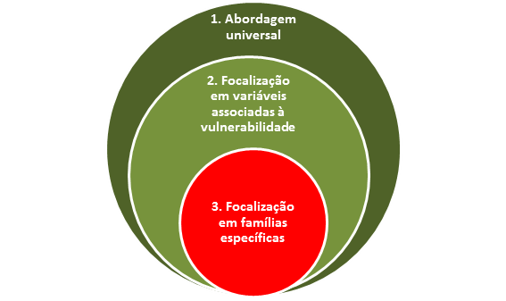

## Aspetos Transversais {#aspetos-transversais}

### Restrições Administrativo-legais, ambientais e urbanísticas {#restri-es-administrativo-legais-ambientais-e-urban-sticas}

Nas actividades de preparação da Operação do Cadastro Predial é necessário ter em conta as restrições legais que limitam o direito de propriedade (ex. domínio público do Estado ou dos Municípios), assim como as restrições administrativo-legais e ambientais que podem ter algum impacto na ocupação e uso dos solos ou que põem em risco o bem-estar e a segurança colectiva. A sua identificação prévia é fundamental, para que possam ser assinaladas na base de dados do Cadastro Predial. Sempre que necessário, devem motivar recomendações, sejam estas quanto à adequação dos usos às restrições, à implementação de medidas de mitigação, ou à indicação de um possível realojamento/ reassentamento no futuro.

Nesse sentido, a realização das operações para constituição do Cadastro Predial são uma oportunidade de rastreio no terreno de potenciais situações de desrespeito/incumprimento da lei, incluindo no que tange à ocupação de áreas de utilidade pública, e de ocupação e usos inaceitáveis do ponto de vista ambiental e da segurança, até mesmo do ponto de vista urbanístico, como por exemplo no caso de ocupação de passeios e via pública. São informações de grande utilidade para as várias entidades gestores de áreas com restrições, que devem ser envolvidas o mais cedo possível no processo, nomeadamente durante a elaboração do diagnóstico prévio para identificação / mapeamento das restrições a ter em conta no âmbito de cada Operação. Dentro de cada tipo de restrição (ex. aeronáutica, áreas de protecção, etc.) devem ser aprofundados os subníveis de condicionantes. Por exemplo no caso de uma servidão aeronáutica, devem ser analisadas as zonas que colocam maior condicionantes em razão do risco que representam. Com base nesta análise devem ser inseridos no LMITS os respectivos _layers_. Pode haver necessidade de criar _buffers_ (limite de áreas envolvente/tampão) (ex. no caso de linhas de água, ou de uma ETAR).

A constituição de Cabo Verde reconhece no seu artigo 69, o direito à propriedade privada, assim como a sua transmissão em vida ou por morte. Pelo que na quase totalidade dos casos não está em causa a titularidade. Uma excepção são os bens do domínio público, sob gestão do Estado ou do Município, que são inalienáveis, impenhoráveis e imprescritíveis. Desde logo, neste caso qualquer afectação só pode ser feita a título precário. Contudo, na maior parte dos casos, existem antes limitações que as restrições administrativo-legais introduzem ao uso da terra, condicionantes que se encontram reflectidas nas servidões administrativas ao uso dos solos, bem como as outras condicionantes delimitadas que se encontram definidas na legislação Cabo Verdiana nos diversos planos de desenvolvimento municipais ou legislações específicas nas Planta de Condicionantes Especiais. Sempre que nalguma situação se possa justificar uma expropriação, existem garantias e a Constituição prescreve que “_A requisição ou expropriação por utilidade pública só podem ser efetuadas com base na lei_”. Garantias que são reforçadas no contexto das Operações do Cadastro predial, em virtude da aplicabilidade dos padrões internacionais para reassentamento (ver seção que se segue sobre o reassentamento).

As áreas definidas na legislação como sendo destinadas à proteção da diversidade biológica e/ou dos recursos naturais associados à recolha e armazenamento da água, à paisagem, à estabilidade geológica, ao solo, às áreas protegidas, constituem parte integrante do conjunto de unidades de grande relevância ambiental e podem ser tidas em conta no âmbito das Operações do Cadastro predial, na medida em que se encontram espelhadas nos PDM e EROT e nas respetivas legislações.

Para além das áreas definidas na legislação como espaços protegidos por serem representativas de elementos da biodiversidade, existem as Zonas Turísticas Especiais (ZDTI e ZRPT) que foram definidas pelo seu elevado valor natural e paisagístico e potencial de gerar correntes turísticas nacionais e internacionais. Nos casos em que exista confluência de área, os usos ou atividades devem ajustar-se ao diploma e devem também ajustar-se às delimitações e às demais determinações dos planos de ordenamento das áreas protegidas, quando estes se materializarem. Não havendo compatibilidade, a legislação (Decreto-Lei nº3/2003, artigo 14º) estipula que devem prevalecer os interesses de conservação, o que pode levar a uma situação de reassentamento/realojamento.

Visando solucionar as falhas nos assentamentos humanos, torna-se fundamental contar não só com as áreas de risco de inundações e deslizamento de terras (riscos antrópicos) mas também com os riscos naturais (sísmicos, vulcânicos).

Assim, podem ser conceituadas os seguintes diferentes tipos (temas) de análise, que darão origem, por sua vez, a camadas (_layers_ no LMITS):

Restrições administrativas/legais, incluindo:

Áreas de servidão: tais como servidão aeroportuária, aeronáutica, militar, etc. Visam garantir a segurança e eficiência da utilização e funcionamento de infra-estruturas e instalações de apoio, e a protecção de pessoas e bens à superfície.

Áreas de domínio público: orla marítima e outras áreas definidas por lei como sendo do domínio público, do Estado ou do Município, incluindo a áreas reservadas ao desenvolvimento das infra-estruturas públicas (estradas, praças, infra-estruturas sociais, etc.), etc. Em termos urbanísticos, estão sendo registadas, no âmbito do Cadastro Predial, as construções que se apropriam indevidamente do espaço público (ex. avançados de casas nos passeios / estrada, estruturas para pátio / esplanadas de restaurantes / comércios)

Áreas de utilidade pública: existem as Zonas Turísticas Especiais (ZDTI e ZRPT) que foram definidas pelo seu elevado valor natural e paisagístico e potencial de gerar correntes turísticas nacionais e internacionais.

Restrições ambientais, incluindo:

Áreas de Proteção (**áreas protegidas** e **património cultural**): são áreas definidas na legislação como destinadas à protecção da diversidade biológica (áreas de biodiversidade única, de habitat crítico, etc.) e/ou dos recursos naturais associados à recolha e armazenamento da água, à paisagem, à estabilidade geológica, ao solo, etc. Nesses ecossistemas estão presentes endemismos, reservas da biosfera, sítios de património cultural, biomas especiais ou mesmo ecossistemas frágeis, etc., sendo por isso zonas sujeitas a restrições quanto ao uso dos solos. As **áreas protegidas** (reserva natural, parque natural, parque nacional, monumentos naturais, paisagens protegidas, sítios de interesse científico) não são compatíveis com habitação. Quanto a áreas de **património cultural**, o uso habitacional é condicionado ao parecer da entidade tutelar. Os respectivos instrumentos de ordenamento (ex. planos de gestão) definem os usos admissíveis, a sua intensidade e as medidas de gestão que devem ser observadas, devendo prevalecer sempre a conservação quando há conflito com outros interesses que coloquem em risco a integridade dos espaços protegidos (incluindo sobreposição de áreas de restrição diferentes, como no caso das ZDTI), de acordo com o Decreto-Lei nº3/2003\. No caso de espaços já estarem habitados, os usos devem ser compatibilizados com os objetivos de conservação.

Áreas de vulnerabilidade climáticas: áreas vulneráveis aos impactos das mudanças climáticas e aos riscos climáticos extremos que apresentam algum risco à saúde pública e não só. Têm impacto directo no que respeita a submersão e erosão costeira, aumento de áreas inundáveis e salinidade das ribeiras e águas costeiras

Áreas de risco / segurança pública: áreas impróprias ao assentamento humano por estarem sujeitas a riscos naturais ou decorrentes da ação humana, tais como zonas de duvidosa segurança geotécnica, zonas de inclinações extremas com propensão a riscos (ex. risco vulcânico e sísmico; riscos de cheias repentinas e/ou inundação; risco por contaminação do solo, de água e/ou de contaminação atmosférica); prédios encravados, que não permitem acesso em caso de emergência (ex. bombeiros).

É preciso ter em conta que existem situações de sobreposição de restrições, que devem ser analisadas do ponto de vista da titularidade (ex. domínio público, como no caso da orla marítima) e o dos usos do solo (ex. verificando quais as condicionantes que se aplicam em prioridade).

Tecnologia SIG na identificação das restrições ambientais

Através da tecnologia SIG e as suas ferramentas de geo-processamento cria-se uma série de relatórios em forma de mapas em camadas (_layers_) bem estruturados onde em cada uma destas terá informação sobre restrições que irão ajudar na tomada de decisão dos operadores de cadastro. O sistema facilita o trabalho dos analistas ambientais porque viabiliza uma visão integrada dos planos de informação (temas/camadas) selecionados, possibilita a visualização do cenário atual e ainda permite caracterizar um cenário prospetivo de implantação de uma actividade/construção no solo.

Ferramentas de apoio ao tratamento das restrições no âmbito da Operação

O Manual contém 3 ferramentas que acompanham os trabalhos da Operação, nomeadamente uma ferramenta para a caracterização das seções cadastrais (que permite identificar as seções sujeitas a uma ou mais restrições, bem como os polígonos afectados); uma segunda ferramenta para recolher dados complementares durante as visitas de terreno (essencialmente as informações a recolher dizem respeito aos usos dados aos prédios, para poder determinar se são compatíveis ou não com as condicionante, e à autorizações administrativas que os titulares possam ou não ter para o desenvolvimento das suas actividades); a terceira ferramenta visa apoiar a emissão de pareceres, nomeadamente se devem ser previstas medidas de mitigação e/ou de reassentamento/realojamento.

### Aspetos Sociais e de Género {#aspetos-sociais-e-de-g-nero}

Ao planear e executar uma Operação do Cadastro Predial é necessário definir quais os elementos mínimos e imprescindíveis a acionar para garantir que as atividades de registo da terra não irão exacerbar as desigualdades sociais e de género pré-existentes. Ou seja, há que definir uma estratégia social e de género, elaborada com base na caracterização dos principais riscos a que estão sujeitos os mais vulneráveis em matéria de acesso e controlo da terra/propriedade. A estratégia deve ainda ter em conta as características das operações de cadastro (metodológicas, técnicas, processuais) a fim de identificar oportunidades/portas de entrada para focalizar as questões sociais e de género que carecem de atenção.

Com efeito, as políticas e programas têm um impacto social e de género diferenciado nas pessoas, de acordo com a sua situação de partida. Para que os direitos de todos possam se materializar em circunstância de igualdade (igualdade de resultados) é necessário prever, para algumas pessoas/famílias/grupos, medidas deliberadas para corrigir as circunstâncias de desvantagem e exclusão em que se encontram, aplicando medidas de ação afirmativa.

A este respeito a constituição de Cabo Verde reconhece a necessidade de garantir proteção especial a alguns segmentos da população e, no seu artigo 7º, assigna responsabilidades ao Estado na remoção dos obstáculos de natureza económica, social, cultural e política que impedem a real igualdade de oportunidades entre os cidadãos, especialmente os fatores de discriminação da mulher na família e na sociedade.

No contexto do Cadastro Predial, o quadro legal e regulamentar determina medidas orientadas à garantia dos direitos das pessoas em situação de vulnerabilidade. Prevê em particular:

1.  Medidas facilitadoras da regularização fundiária da posse nas zonas definidas como Área Urbana de Génese Ilegal (AUGI), que são áreas urbanas essencialmente ocupadas por famílias vulneráveis; medidas que se aplicam também, com as devidas adaptações, a situações de construções clandestinas fora de áreas urbanas ou urbanizáveis (ou seja a assentamentos informais fora das áreas urbanas, com construções isoladas ou contíguas, decorrente de ocupação espontânea);
2.  Medidas facilitadoras da remição do foro no regime de aforamento, com vista à aquisição da propriedade plena, sabendo-se que o regime de aforamento impacta famílias com menos posses;
3.  Dispensa de alguns procedimentos (tais como do princípio do trato sucessivo em algumas situações, nomeadamente de herdeiros, ou ainda da publicação em jornais nacionais dos extratos de editais nas escrituras públicas de habilitação de herdeiros ou de justificação notarial) e a aprovação de um quadro de incentivos administrativos (isenções e redução de emolumentos notarias e registrais, do IUP sobre a transmissão e imposto de selo), sabendo-se que os custos com estes procedimentos são elevados, o que no caso de titulares vulneráveis pode tornar-se um impedimento à formalização dos direitos;
4.  A participação enquanto princípio geral, reforçando a atuação cívica dos cidadãos, mediante acesso à informação e à participação nos procedimentos de execução e conservação do cadastro;
5.  A obrigação, por parte da entidade executante (EE) da operação de cadastro, de adotar medidas de apoio aos grupos vulneráveis no processo de Declaração de Titularidade dos seus prédios, na demarcação e identificação física do seu prédio e reconhecimento do respetivo direito, incluindo os diferentes possuidores informais e detentores de direitos reais secundários tais como aforamento, direito de usufruto e direito de superfície. Ou seja, ao longo de toda a operação de cadastro e de acordo com as várias situações em que se podem encontrar as pessoas mais vulneráveis.

Em relação à equidade de género na inscrição no Cadastro Predial, o Regime Especial prevê que no «processo de declaração e inscrição dos titulares cadastrais, relativamente a prédios que, à luz da lei, sejam bens comuns ou suscetíveis de serem reconhecidos como tal, **deve constar o nome do cônjuge ou convivente**, conforme seja casado ou viva em união de fato com o sujeito ativo, bem como o respetivo regime de bens, ...», propondo que a EE, entidades envolvidas e titulares implementem os seguintes procedimentos / opções para o efeito:

1.  Verificação pela EE da certidão de casamento (ou de união de fato) e respectivo regime patrimonial (através das bases de dados da administração pública);
2.  Informação aos casais em união de fato quanto às formas de fazer valer os direitos de ambos (pelo reconhecimento da união de fato, devendo constar da respectiva certidão a data de início da união ou, em alternativa, mediante escritura pública de constituição de compropriedade, par além dos demais meios previstos por lei);
3.  Simplificação do tratamento destas escrituras públicas e seu processamento em bloco, mediante modelos pré-elaborados e a aproximação dos serviços aos cidadãos, através da deslocação do Notário à comunidade;
4.  Recolha pela EE de todas as informações relevantes em situações de união (data do início da união de fato e da aquisição);
5.  Acompanhamento de situações de vulnerabilidade pela Casa do Direito, Centro de Mediação e ONG.

Em relação ao Registo Predial, no caso de bens comuns, os cônjuges ou conviventes serão inscritos juntamente com o sujeito ativo, por meio de menção do nome do cônjuge e do regime de bens do casamento e, no caso de conviventes, também da data do início da coabitação. Este procedimento aplica-se tanto à primeira descrição de um bem imóvel no Registo Predial, como à atualização das descrições registais (averbamento).

Com base nestes pressupostos, a presente secção descreve a forma de operacionalizar a abordagem social e de género no âmbito de uma operação de cadastro. Apresenta:

Os desafios sociais e de género que tipicamente surgem nos processos de clarificação de direitos e limites, e de registo de propriedade;

O que se entende por vulnerabilidade, quais os principais grupos vulneráveis a considerar e os critérios a utilizar para a identificação de famílias nessa situação;

As oportunidades/portas de entrada que devem ser consideradas, durante a planificação e execução das operações, para garantir a integração transversal das preocupações sociais e de género.

Subsequentemente estes pontos serão detalhados ao longo de várias secções do Manual (sequências típicas e ferramentas práticas), com vista a orientar a ação em diferentes etapas das operações de cadastro, e a identificação dos grupos, famílias e pessoas que podem precisar de apoio adicional para proteger os seus direitos.

A. Os principais desafios sociais e de género no contexto da execução do cadastro predial

Em preparação das operações de cadastro do Sal, Boavista, São Vicente e Maio, foi realizado um estudo prévio para identificar os potenciais impactos sociais e de género associados à clarificação de limites e direitos, bem como as possíveis medidas para a sua mitigação. O estudo fornece elementos valiosos para o entendimento de possíveis situações de vulnerabilidade, sem prejuízo da necessidade de outros estudos complementares para operações em áreas com características diferentes.

Entre as situações de vulnerabilidade, constam:

Tabela 2 - Situações e medidas de mitigação para situações de vulnerabilidade

| Situação de vulnerabilidade / risco | Medidas as acionar para mitigação dos riscos / vulnerabilidade |
| --- | --- |
| Situação | Exemplos |  |
| Situação de posse insegura, em muitos casos devido ao acesso limitado à terra / habitação para pobres (limites municipais deixam pouco espaço para expansão da população e habitação, o que associado ao custo elevado - fora das possibilidades da maioria das famílias pobres, leva ao desenvolvi-mento de áreas periurbanas fora dos limites Municipais). | Construções em processo de legalização; | Pôr em prática medidas, em particular as do Regime Especial (AUGI, aforamento, etc.), de apoio às famílias vulneráveis na legalização de lotes existentes, o que implica: |
| Os direitos das mulheres casadas ou em união de facto (reconhecida ou reconhecível) mais inseguros do que os dos homens | Desconhecimento, por parte das mulheres, homens e comunidades dos direitos ao registo conjunto dos terrenos / prédios adquiridos durante o casamento / união de facto (ex. no casamento vigora o regime de comunhão de adquiridos, na ausência da escolha de outro regime; a união de facto reconhecida é equiparada ao casamento e pode ser reconhecida após 3 anos de convivência ou, havendo um ou mais filhos comuns do casal, em qualquer momento da união; a união de facto reconhecível - mesmo que não tinha sido objeto de reconhecimento registral, pode ser reconhecida judicialmente, com efeitos na divisão dos bens comuns); | Pôr em prática a inscrição cadastral conjunta, de acordo com o previsto na Lei, o que implica: |
| Pessoas sem conhecimento dos seus direitos, e/ou falta de recursos para acionar esses direitos, já que o exercício de direitos, ou fortalecimento dos existentes, implica recursos, conhecimentos e capacidades. | Por exemplo pessoas: | Promover a máxima participação e benefícios com a Operação. O que implica: |
| Pessoas ausentes do país | Em particular emigrantes os que não têm representan-tes legais no país. | Promover a máxima participação e acesso à informação para a diáspora e estrangeiros ausentes do país, para um bom entendimento da Operação e de como proteger os seus direitos. O que implica: |

B. Os grupos vulneráveis: quem são e como os identificar

A vulnerabilidade refere-se à maior ou menor capacidade de uma pessoa, família, grupo ou comunidade de antecipar, lidar, resistir e recuperar-se de uma ameaça. Nesse sentido a vulnerabilidade revela-se sobretudo no advento de calamidades, contudo é uma condição pré-existente que afeta a capacidade individual, familiar ou comunitária de se preparar e recuperar de eventos disruptivos.

Fica desde logo claro que a pobreza contribuiu grandemente para a vulnerabilidade na medida em que os pobres têm maior probabilidade de viver ou trabalhar em contextos mais expostos a riscos. Perante estes riscos podem ter menor capacidade de resposta, se tiverem menos recursos (físicos, materiais, competências e atributos) para lidar com a adversidade. Os dados existentes a nível nacional apontam para uma forte ligação da pobreza ao nível educativo da pessoa/representante da família, seu estatuto perante o emprego, e também com a tipologia familiar (famílias com representante feminino, monoparentais, numerosas) e a zona de residência (rural/urbano).

Conforme o quadro apresentado acima, estão em situação de vulnerabilidade, no âmbito de uma Operação, pessoas que:

Não têm a documentação necessária para demonstrar os seus direitos;

Não constam da documentação existente: como por exemplo quando existe bem comum, no casamento ou na união, mas o bem imóvel está apenas em nome de um dos cônjuges, na maioria dos casos em nome do homem. O(a) titular que não é mencionado(a) nos documentos, em particular no caso da união de fato não reconhecida, encontra-se em situação de vulnerabilidade, por falta de meios para provar a sua titularidade);

Estão em situações de posse que pode não implicar aquisição de direito.

A EE deve assim assegurar um apoio particular a situações de:

1.  Assentamento informal (AUGI e fora das AUGI);
2.  Beneficiários de habitação social;
3.  Titulares em união de facto não reconhecida;
4.  Titulares vulneráveis que precisam realizar procedimentos de formalização: ou seja titulares com menor acesso a informações e sem os conhecimentos, capacidades e meios para entender e realizar os procedimentos necessários no âmbito de uma Operação.

Para este último ponto, durante a operação de cadastro, será necessário identificar pessoas/famílias vulneráveis concretas, que precisam realizar procedimentos de formalização, para poder direcionados para elas a informação e os recursos de que precisam para exercer os seus direitos sobre terras e reivindicá-los quando necessário.

Ao definir as estratégias para o efeito, há que considerar os custos-benefícios de uma identificação mais descriminada, pessoa a pessoa e família a família, na medida em que a mensuração da vulnerabilidade é complexa e os métodos disponíveis para o efeito acarretam custos e meios (financeiros, recursos humanos, tempo). Devem assim ser ponderados perante as vantagens/desvantagens que trazem. Propõe-se assim que a focalização nos grupos vulneráveis no âmbito das operações de cadastro siga 3 níveis de aproximação:

Figura 3 - Níveis de aproximação aos grupos vulneráveis

1.  **Abordagem “universal”** tem em conta todos os potenciais beneficiários, ao mesmo tempo que chega aos mais vulneráveis

Exemplos de medidas:

Informações e mensagens para todos, que também chegarão aos mais vulneráveis (comunicação de massas, serviços próximos dos cidadãos, etc.);

Como previsto no caso das isenções administrativas, que minimizam os custos de alguns serviços essenciais para a formalização de direitos para todos, beneficiando em particular quem tem menos posses.

1.  **Focalização em variáveis associadas à vulnerabilidade**, o que permite durante o trabalho de terreno, ao chegar às casas/parcelas, assinalar as pessoas/famílias com uma ou mais das características selecionadas para a focalização. Com base nesta sinalização, as estratégias de sensibilização são reforçadas e adaptadas. Sempre que necessário, é oferecido apoio para a realização de procedimentos (demarcação, Declaração de Titularidade, etc.). Este nível de aproximação dos grupos vulneráveis, feito através de um rastreio rápido executado pelos inquiridores no início da visita, é suficiente para identificar as pessoas/famílias/grupos que precisam de mais atenção e, possivelmente de serem sinalizadas à equipa social e de género.

Variáveis a sinalizar na visita inicial da equipa de terreno à parcela:

Tendo como referência o(a) **representante do agregado** de que faz parte o(a) titular**,** sinalizar as seguintes situações:

Baixo nível educativo: representante é analfabeto(a), alfabetizado(a), tem educação primária;

Representante do agregado é mulher;

Situação de desemprego ou emprego com características de precariedade: representante é desempregado(a), trabalhador(a) sem remuneração, tem emprego sazonal/ocasional, tem ocupação agrícola/piscatória, é emprego(a) doméstico(a), ou outra situação de emprego precário;

Tendo como referência o(a) **titular,** sinalizar as seguintes situações:

União de facto: registar obrigatoriamente a data de início da união e a data de aquisição do bem imóvel;

Emigrante ausente sem representante legal no país

Nacional de outro país **SE** não domina português ou crioulo

Existência de necessidades especiais; idosos com dificuldade de deslocação, deficiência física que limita a deslocação, deficiência visual, deficiência auditiva, outra

Nota: a união de facto não reconhecida é a situação de maior vulnerabilidade do ponto de vista do género, contudo deve ainda ser analisado o estado civil do(a) titular, na medida em que pode implicar a recolha de mais informações (ex. regime patrimonial de casamento, sentença de divórcio, etc.).

1.  **Focalização em famílias específicas**, as que forem identificadas como necessitando de um seguimento de perto e que podem precisar de serviços de apoio mais descriminados, em termos de atendimento social, jurídico, de mediação de conflitos, encaminhamento para tribunal, etc.

Estas famílias são sinalizadas a partir:

1.  Do rastreio rápido executado pelos inquiridores no início da visita, que os podem referenciar ao Gabinete de Apoio ou solicitar uma visita ao terreno do(a) técnico(a) social ou do(a) jurista (ex. situações de união de facto em que não há entendimento quanto à noção de bem comum e como salvaguardar os direitos dos dois titulares; situações complexas do ponto de vista da titularidade e meios de prova; etc.);
2.  Da equipa de comunicação de proximidade, que ao fazer o seu trabalho de comunicação no terreno pode identificar situações que ultrapassam a sua capacidade de prestar informações
3.  Do backoffice, onde são harmonizados os dados e emitidos os pareceres legais, fazendo sobressair questões relativas à posse insegura, falta de meios para demonstrar a titularidade, etc.
4.  Do próprio Gabinete de Apoio, onde as pessoas se podem dirigir directamente para procurar informações, aconselhamento jurídico; podem ir por sua iniciativa ou referenciadas por instituições (ex. Casa do Direito, Câmara, etc.), organizações da sociedade civil, etc.

Com base nas sinalizações e encaminhamentos recebidos, a equipa social e de género do Gabinete de Apoio identifica, classifica e regista o tipo de vulnerabilidade e identifica as medidas de apoio a realizar (as ferramentas ASG explicitam os detalhes a respeito).

C. Principais oportunidades/portas de entrada para a integração transversal de uma abordagem social e de género numa operação de cadastro:

As pessoas/grupos vulneráveis têm características diversas que levam a necessidades diferenciadas. Globalmente haverá que garantir:

A participação dos grupos alvo mais vulneráveis;

O seu acesso às informações sobre a operação de cadastro;

Apoio na realização dos procedimentos que se esperam dos titulares de propriedade ou de outros direitos secundários, durante as várias etapas da operação de cadastro, entre os quais se destacam:

O preenchimento da Declaração de Titularidade, com enfoque na cotitularidade sempre que aplicável;

A demarcação dos limites do prédio;

A verificação de dados da caracterização provisória durante a etapa de consulta pública;

A submissão de possíveis reclamações;

Apoio na formalização dos direitos que se mostrem informais, ao longo de todas as etapas da Operação, para que estejam na posse da documentação necessárias para comprovar os seus direitos;

Apoio em termos de aconselhamento jurídico e para a resolução de conflitos;

Apoio na solicitação das isenções no âmbito da Operação;

Apoio no encaminhamento para outros serviços (ex. patrocínio judiciário em situações de reconhecimento judicial de união; habilitação de herdeiro em que existe menor; denúncia de VBG quando desencadeada a propósito de situações patrimoniais no âmbito da Operação, etc.).

Assim sendo, de seguida se identificam os pmrincipais pontos de entrada, ao longo das diferentes etapas da operação, em que existe a oportunidade de potenciar a participação dos grupos vulneráveis e contribuir para que os seus direitos possam se materializar.

| Etapa: Preparação da Operação de Cadastro |
| --- |
| Porta de entrada | Medidas / ações |
| Recolha de dados / seguimento | Planear a desagregação dos dados que vão ser recolhidos ao longo da operação de cadastro (por género e grupos vulneráveis). |
| Caracterização das seções/blocos cadastrais | Caracterizar mediante indicadores socioeconómicos e probabilidade de encontrar as situações de risco e vulnerabilidades. |
| Formação | Assegurar a formação de todos os envolvidos (toda a equipa da EE, instituições parceiras) em sensibilidade social e de género, para que possam: |
| Constituição da equipa | Promover a paridade de género na equipa. |
| Comunicação | Assegurar estratégias, atividades e produtos de comunicação focados em grupos particulares tendo em conta as suas necessidades de informação. |
| Parcerias | Promover a participação das pessoas vulneráveis concertando com parceiros locais as estratégias de sensibilização sobre questões de género e como as implementar (engajamento de lideranças, engajamento de homens, sessões de esclarecimento dedicadas a grupos alvos identificados). |
| Recolha de informação | Apoiar a equipa na utilização das ferramentas de rastreio durante a caracterização dos titulares. |
| Seguimento das situações identificadas | Identificar necessidades e apoiar vulneráveis na concretização de procedimentos necessários para a formalização de direitos (apoiar a articulação interinstitucional a partir do gabinete de apoio, seguir processos, coordenar com parceiros a caracterização socioeconómica de famílias específicas quando necessário, etc.). |
| Elaboração de pareceres | Elaborar pareceres sociais e de género para submissão à EAT. |
| Divulgação da consulta pública e apoio à consulta da caracterização provisória | Apoiar a consulta pública e boa compreensão do mecanismo de reclamações. |
| Seguimento das situações identificadas | Acompanhar pessoas vulneráveis na concretização de procedimentos necessários para a formalização de direitos e na resolução de conflitos, com vista a garantir o cumprimento das condições necessárias para o registo predial. |

Como mencionado no quadro, a propósito da constituição da equipa da entidade executante, a implementação de uma estratégia social e de género exige a disponibilidade de um/uma responsável por estas questões.

### Reassentamento/Realojamento {#reassentamento-realojamento}

Os programas que trabalham em aspetos relevantes para o ordenamento do território, como é o caso de uma operação de cadastro, não provocam obrigatoriamente o reassentamento involuntário. Contudo, podem identificar situações que no futuro podem implicar aquisição de terras, com base nas leis de expropriação em vigor. Ou, mesmo que não impliquem expropriação (por exemplo quando o Estado ou Município é o titular da terra), uma operação de cadastro pode identificar situações em que o uso da terra deverá ser compatibilizado com as restrições previstas por lei (ex. restrições ligadas a servidões, áreas protegidas, planos de desenvolvimento urbano, etc.).

Com efeito, o reassentamento depende da intenção do Estado em adquirir uma propriedade por razões de segurança pública ou de uso público, uma decisão que é independente do registo dessa propriedade. Ou ainda, uma decisão de fazer valer os instrumentos legais que definem os usos previstos para a terra (quer o Estado seja proprietário da terra, quer esta seja de um privado).

O fato do Estado poder, com base nas leis em vigor, adquirir propriedades (ou fazer valer restrições previstas por lei ao uso das terras) não significa que o vai necessariamente fazer, tendo a opção de tolerar as situações no seu estado atual enquanto não decidir por outra linha de ação (aquisição ou possíveis medidas de mitigação).

Contudo interessa ter em conta que, nas situações em que vier a haver reassentamento involuntário, este deve ser feito respeitando os standards e princípios internacionais contidos no _Performance Standart 5_ (PS 5) para _Land Acquisition and Involuntary Resettlement,_ desenvolvido pela Sociedade Financeira Internacional (International Finance Corporation – IFC).

Assim sendo, nesta secção são apresentadas (i) as situações que poderão dar azo a uma futura iniciativa de reassentamento, ou seja suscetíveis de acionar o PS 5 e (ii) os princípios e standards do PS 5 e ações a prever em situações que desencadeiam o PS 5.

De referir que existe uma política para o **_Reassentamento e Restauração dos Meios de Subsistência_** no contexto das operações de cadastro, documento que consta dos anexos deste Manual.

O que é o PS 5 e que ações prever em situações que desencadeiam o PS 5

O PS 5 visa proteger os vendedores de terrenos/propriedades de uma variedade de riscos inerentes a transações negociadas no contexto de expropriações.

O reassentamento involuntário no âmbito do PS 5 refere-se tanto ao deslocamento físico (deslocação ou perda de abrigo) como ao deslocamento económico (perda de bens ou acesso a bens que levam à perda de fontes de rendimento ou a outros meios de subsistência).

O reassentamento é considerado involuntário quando as pessoas ou comunidades afetadas não têm o direito de recusar a aquisição de terrenos ou restrições sobre o usufruto do terreno. Contudo há que ter em conta que existe a possibilidade do potencial reassentamento/realojamento resultar de uma negociação amigável, em que a compensação é acordada, não sendo por isso um processo involuntário.

Os princípios a respeitar incluem:

Evitar o máximo possível o reassentamento involuntário (medidas de mitigação, negociação, etc.) e, se inevitável, minimiza-lo explorando todas as alternativas viáveis.

Perante deslocamento físico e/ou económico, realizar um censo para identificar as pessoas que serão deslocadas e recolha de base socioeconómica apropriada.

Consultar de forma significativa as pessoas afetadas e dar oportunidade de participação no planeamento, execução e acompanhamento dos programas de reassentamento e compensação.

Preparar um RAP, LRP ou RLRP (ver tabela que se segue).

As atividades de reassentamento e compensação devem ser concebidas e executadas fornecendo recursos suficientes para, pelo menos, restaurar os meios de vida e padrões de vida prévios e proporcionar às pessoas afetadas oportunidade de compartilhar os benefícios do projeto que levou ao reassentamento.

A compensação deve ser paga em tempo útil.

As pessoas afetadas devem ser assistidas nos seus esforços de melhorar as suas condições de vida e padrões de vida ou, pelo menos, restaurá-los, em termos reais, aos níveis prévios.

Devem ser estabelecidos procedimentos para monitorizar e avaliar a implementação do RAP, LRP ou RLRP.

A implementação do RAP, LRP, ou RLRP finda quando os impactos adversos do reassentamento foram abordados, em conformidade com o plano correspondente, e objetivos do PS 5\.

O PS 5 prevê uma atenção especial aos grupos vulneráveis, incluindo esforços para incorporar os seus pontos de vista no processo de planeamento do reassentamento. As medidas especiais podem incluir: grupos focais com grupos de risco e vulneráveis; inclusão nos comités de reassentamento de membros de grupos vulneráveis; medidas de acesso a eventos de consulta ou fóruns de discussão (ex. fornecer transporte, mobilizar mediante visitas individuais); apoio para a compreensão das suas opções de reassentamento e compensação e incentivo à escolha de opção com menor risco. Cada categoria de população vulnerável tem necessidades distintas, pelo que devem ser identificadas as necessidades de cada grupo para garantir que compreendem a natureza da operação e que são capazes de proteger os seus interesses.

O instrumento do PS 5 a desenvolver depende da natureza dos impactos, conforme de seguida se descreve:

| Ações | Quando |
| --- | --- |
| Plano de Ação de Reassentamento (RAP) | Quando existe apenas deslocação física |
| Plano de Restauração dos Meios de Subsistência (LRP) | Quando existe apenas deslocamento económico |
| Plano de Reassentamento e Restauração dos Meios de Subsistência (RLRP) | Quando há deslocamento físico e económico |

**Situações em que pode ser, no futuro, desencadeado o PS 5**

A consideração fundamental para determinar se o PS 5 se aplica é a eventualidade do Estado pretender adquirir um terreno/imóvel, ou limitar os direitos de acesso/uso, em razão de utilidade pública ou garantir condições de saúde e segurança pública. Esta decisão pode acontecer em várias circunstâncias, que de seguida se apresentam, quer a gestão da área em questão esteja sob a responsabilidade do Município, do Governo Central ou de ambos.

Áreas sob a gestão Municipal

O Município pode querer proceder à aquisição de prédios, para que as respetivas áreas estejam em conformidade com o plano municipal aprovado.

| Situação | Opções | Aplicabilidade do PS 5 |
| --- | --- | --- |
| Propriedade privada que invade a propriedade Municipal, nomeadamente infraestruturas para uso público, tais como estradas, mercados, parques, escolas, centros de saúde | Aceitar a invasão e fornecer título de propriedade privada na sua totalidade. | Não se aplica o PS 5. |
|  | Respeitar o plano municipal e fornecer título apenas pela parte administrativa reconhecida da propriedade privada (tomando de volta área invadida) | Município possui a terra invadida, pelo que não haveria aquisição. |
|  | Respeitar o plano municipal, tomar de volta a área da propriedade municipal e demolir qualquer estrutura existente |  |
| Propriedades privadas consideradas inseguras ou insalubres, tais como encostas íngremes e declives, linha de maré ao longo da costa, solos salinos, margens e leitos dos rios, canais de esgoto a céu aberto. | Não registar propriedades localizadas num local inseguro ou insalubre, por estarem em violação grave dos planos aprovados e dos códigos de ordenamento de territórios municipais (risco à integridade da estrutura e à saúde e segurança dos ocupantes). | Se não houver medidas de mitigação possíveis &amp; verificada a necessidade de deslocar residências e empresas, a implementação da deslocação desencadeia o PS 5. |
| Propriedade necessária para o bem público (segurança pública), tais como parcelas encravadas, sem acesso de veículos (ex. no caso de emergência) | Aquisição de terreno para fornecer acesso de veículos. | Aquisição de faixa/ propriedade através de negociação amigável |
|  |  | Expropriação desencadeia PS 5 |

Áreas cogeridas pelo Município e Governo Central

| Situação | Opções | PS 5 |
| --- | --- | --- |
| Área declarada ZDTI | Legalmente sujeita a expropriação em qualquer momento | PS 5 aplicável, exigindo a elaboração de um Plano de Acão de Reassentamento (isto a partir de 1 de Janeiro de 2014) |
| Zonas de Reserva e Proteção Turística (ZRPT), | A ocupação ou usufruto é permitido, mas não podem ser feitas melhorias à propriedade | PS 5 aplica-se porque os direitos de usufruto serão restritos. |

Áreas de Gestão do Governo Central

Em particular as zonas rurais administradas pelo Estado, incluindo a propriedade privada, conforme cedência pelo Estado a pessoas, ao longo do tempo.

| Situação | Opções | PS 5 |
| --- | --- | --- |
| Proprietário de propriedade privada: limites vagos (ex. terrenos cedidos antes da independência) | Estado oferecer um título seguro à entidade privada em troca de uma área menor. | Se aceitável para o proprietário, pode haver assinatura de um acordo (sem acionar PS 5). |
| Direitos costumeiros ou de usufruto do domínio público: em áreas rurais uso das terras de Estado pelas populações locais para diversos fins (pasto, lançamento de barco, etc.) | Os direitos consuetudinários e localmente reconhecidos têm a mesma força de um título jurídico formal. | Se houver mudança no usufruto da terra, deve ser elaborado um plano de reassentamento (indicando apoio à restauração da subsistência das pessoas). |
| Invasão das terras públicas (AUGI à volta dos centros urbanos, terras sob gestão do Governo Central, em que não existe plano municipal para definir o usufruto da terra) | Governo Central pode continuar a tolerar a situação, mas sem registar as propriedades como propriedade privada. | Sem apreensão da terra PS 5 não será acionado. |
|  | Pode demolir as estruturas que foram construídas. | Implica mudança no usufruto da terra, pelo que o PS será acionado e deve ser elaborado um Plano de Reassentamento. |
|  | Pode ceder a área invadida ao Município, que desenvolverá o seu plano de usufruto e que poderá reconhecer o padrão de ocupação existente. | Depende da ação do Município: |
| Reservas e outras áreas protegidas: casos em que houver regularização das terras dentro das reservas | Define restrições que se justifiquem para que a reserva cumpra a sua finalidade pública. | Havendo restrições ao acesso de recursos naturais, o PS 5 é ativado. |

### Comunicação e Sensibilização {#comunica-o-e-sensibiliza-o}

As operações de registo sistemático tocam em vários pontos sensíveis: direitos, segurança, estabilidade e confiança, meios de subsistência e fontes de rendimentos, formalidade/ informalidade, interesses e conflitos de várias ordens, etc. Parte importante da população cabo-verdiana não tem os seus direitos sobre bens imóveis (lotes e casas) clarificados, seguros e transferíveis, situação que o cadastro predial quer contribuir para solucionar.

Ao iniciar a primeira Operação do Cadastro Predial na ilha do Sal, verificou-se que a larga maioria das pessoas, incluindo actores institucionais (exceptuando os directamente implicados nos trabalhos preparativos da Operação) não tinham informações concretas sore a Operação. A larga maioria desconhecia os objectivos, o alcance e as vantagens concretas da Operação (embora reconheçam a importância de uma iniciativa de clarificação dos direitos e limites das propriedades em Cabo Verde). Adicionalmente o nível de informação da população em geral, e dos grupos vulneráveis em particular, sobre o que é necessários para demonstrar os seus direitos é limitado, bem como a compreensão do que fazer para formalizar direitos e as vantagens de o fazer.

Com a Operação da ilha do Sal, foi criada uma imagem de marca para as operações sistemáticas de execução do Cadastro Predial e alguma vertente da comunicação publicitou a iniciativa a nível nacional e junto da Diáspora. Contudo, para cada Operação, a comunicação terá de esclarecer de forma detalhada diferentes grupos alvo em relação à operação de cadastro, seus objetivos, procedimentos para a clarificação de limites e clarificação de direitos, meios para resolução de conflitos, processos de tomada de decisão e incentivos aprovados para promover a participação e acesso de todos.

Quando, para além das questões inerentes a uma operação de cadastro, houver outras questões a tratar (ex. no caso de iniciativas concomitantes, como programas de requalificação urbana, programas de reassentamento, ou outros), será necessário prever abordagens de comunicação específica adicionais.

Entre os grupos alvos destacam-se alguns que precisam de abordagens específicas e diferenciadas para garantir o acesso à informação e participação:

Os que têm menos voz e acesso a informações e a meios de fazer valer os seus direitos;

Os grupos mais vulneráveis e excluídos, entre os quais pessoas em situação de pobreza, mulheres chefes de famílias numerosas, pessoas analfabetas, entre outros grupos que possam ser identificados como vulneráveis numa determinada zona geográfica;

As pessoas que estão em maior risco de não verem os seus direitos registados por não constarem da documentação da propriedade; como por exemplo no caso de pessoas casadas ou em união de facto que, conforme explicitado pelo Código Civil, têm direitos patrimoniais sobre os bens imóveis adquiridos na constância do casamento ou união (bens comuns);

A diáspora, ausente do país e que frequentemente não tem representante legal no país;

Titulares de nacionalidade estrangeira não residentes (sobretudo no caso das ilhas de maior desenvolvimento turístico).

Um dos princípios gerais da execução do cadastro é a participação, “reforçando a atuação cívica dos cidadãos, através do acesso à informação e à participação nos procedimentos de execução e conservação do cadastro” (al. d) do artigo 3º do Regulamento do Regime Jurídico do Cadastro Predial, RRJCP, aprovado pelo Decreto-Regulamentar nº28/2014, de 22 de outubro).

Cada Operação deve dispor de um Plano de Comunicação e Sensibilização adaptado às necessidades de cada ilha/município/zona geográfica, e uma equipa dedicada à sua implementação. O Plano deve ter em conta tanto a vertente de comunicação de massas, como a da comunicação de proximidade, em apoio ao trabalho cadastral (de acordo com o calendário previsto para a recolha de dados em cada seção/bloco cadastral, para as consultas públicas e o trabalho continuo de formalização de direitos). A progressão vai dos aspetos mais macro e meso (comunicação de massas, mobilização institucional e das lideranças locais, o estabelecimento de relações de proximidade com os meios de comunicação social) para os aspetos mais micro (sensibilização no terreno, resposta a necessidades específicas).

Em termos institucionais, as entidades responsáveis e directamente envolvidas, como o INGT, a Câmara, o MCA e a EE, devem estabelecer desde o início um mecanismo de concertação sobre as acções de comunicação e das mensagens a privilegiar em cada momento (concertação sobre “quem” comunica o “quê”, “quando” e “como”) para que todos possam falar a uma voz e reforçar sinergias (grupo técnico dos/as técnicos/as de comunicação de cada entidade, com reuniões periódicas e contactos regulares à distância).

Em termos de envolvimento inicial de todas as forças vivas da sociedade, para além do lançamento oficial da Operação, deve haver (entre outras actividades) sessões de apresentação/discussão da Operação (ex. formato de atelier participativo de meio-dia ou um dia) com o setor público, privado e da sociedade civil: nomeadamente os/as técnicos/as dos diferentes serviços públicos, empresas, imobiliárias, elites profissionais, juristas, organizações da sociedade civil, incluindo ONG, associações de desenvolvimento comunitário e confissões religiosas. Estas sessões visam a mobilização dos diferentes actores, para que sejam aliados na multiplicação de informações e promoção de um ambiente propício à implementação da Operação. O media são ainda outro parceiro privilegiado a mobilizar.

No caso dos emigrantes, são necessárias abordagens focalizadas com o apoio dos seus representantes legais, herdeiros ou inquilinos ou de contactos por carta, correio eletrónico ou através dos consulados cabo-verdianos e das associações de emigrantes e programas de rádio no país e na diáspora, que devem ser utilizados para difundir informações sobre o projeto.

Os estrangeiros com propriedades no país e que não são residentes serão contactados por carta, correio eletrónico ou outras vias através dos seus representantes legais ou, na sua ausência, das embaixadas dos seus países em Cabo Verde.