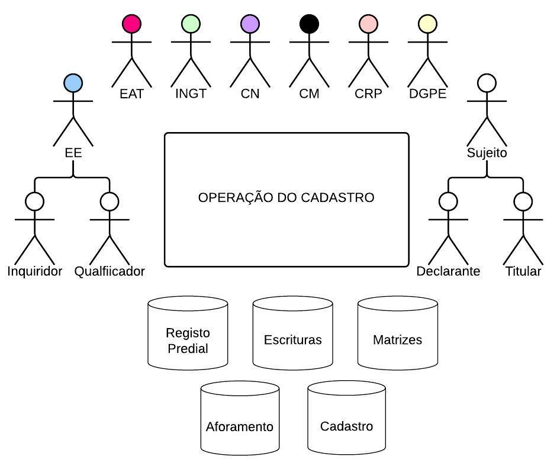

## Atores e responsabilidades {#atores-e-responsabilidades}

As operações do cadastro predial implicam vários atores, incluindo os que têm responsabilidades institucionais - políticas e técnicas, os detentores de direitos, e as forças viva da sociedade em geral. A tabela que se segue descreve brevemente os serviços públicos que detêm responsabilidades no âmbito do cadastro predial, que pertencem a vários ministérios e ao poder local, bem como mecanismos a eles associados, que intervêm nas operações de cadastro. Descreve ainda quem pode ser considerado titular cadastral e as suas responsabilidades.

Figura 2 - Atores e Responsabilidades

Tabela 1 - Atores e responsabilidades

| Atores | Responsabilidades |
| --- | --- |
| INGT | O Instituto Nacional de Gestão do Território é o serviço central responsável pelo Cadastro Predial e, neste âmbito, tem a seu cargo estabelecer diretrizes técnicas; fiscalizar o cumprimento das leis, regulamentos e directrizes; garantir o funcionamento, qualidade e atualização do Cadastro Predial. Nas Operações do Cadastro Predial, cabe-lhe, entre outros: |
| Câmara Municipal | As Câmaras Municipais territorialmente competentes para uma operação, enquanto responsáveis pela administração e gestão dos seus bens públicos e privados, têm responsabilidades específicas no processo: |
| Ministério da Justiça/ DGRNI: | O serviço central responsável pelo Registo, Notariado e Identificação Civil assegura à EE o acesso à informação constante dos seus registos: |
| Ministério das Finanças | A Direcção Nacional de Receitas do Estado (DNRE), no âmbito da Operação, deve: |
| Direcção Geral do Património | A Direção Geral do Património e de Contratação Pública, no âmbito da Operação, deve: |
| Equipa de Apoio Técnico (EAT) | A Equipa de Apoio Técnico é um mecanismo a criar para cada operação de cadastro: integra representantes dos serviços públicos acima identificados. Deve: |
| Casa do Direito (CD) | As Casas do Direito visam garantir o acesso de populações vulneráveis, incluindo mulheres, à Justiça e ao Direito, mediante o fornecimento de informações, consulta jurídica e serviço de mediação gratuitos. O Centro Nacional de Mediação e Arbitragem (CNMA) especializa-se na utilização dos meios alternativos de resolução de conflitos. |
| Casa do Cidadão | Engloba serviços integrados para um atendimento público centrado nas necessidades do cidadão e da empresa. Presta serviços presencialmente, via internet e telefone, entre os quais certidões diversas e válidas no processo de execução do cadastro como emissão de NIF e certidão de NIF, certidão de casamento/óbito, etc. |
| Tribunais Judiciais | Os tribunais são órgãos de soberania com competência para administrar a Justiça, através da resolução de conflitos ou disputas legais. |
| Entidades gestoras de áreas com restrições administrativo-legais | Entidades tais como a AAC, CVI ou SDTIBM, DNA, por serem entidades gestoras de áreas de restrições administrativo-legais e ambientais tidas em conta no âmbito das Operações do Cadastro Predial, devem participar na identificação das condicionantes à ocupação e uso da terra que devem obrigatoriamente constar do Cadastro Predial, bem como das situações _de facto_ que podem justificar medidas futuras de mitigação ou de reassentamento. Com efeito, as entidades gestoras de áreas de restrição são um dos principais públicos que poderá beneficiar deste levantamento / análise. |
| Entidade Executante (EE) | Realiza os trabalhos cadastrais, seja de execução, de renovação e conservação do cadastro predial. |
| Titulares Cadastrais | Incluiu as pessoas – singulares ou coletivas, que são detentoras de algum direito sobre um terreno (construído ou não). A noção de titular cadastral compreende assim não só pessoas que são proprietárias, mas também as que têm outro direito associado a uma propriedade, nomeadamente um dos seguintes: |

Outros atores fundamentais para a execução de uma operação de cadastro são o público em geral e as organizações da sociedade civil, que representam diversos grupos, bem como as instituições e técnicos da comunicação social, enquanto aliados estratégicos para um processo deste tipo.