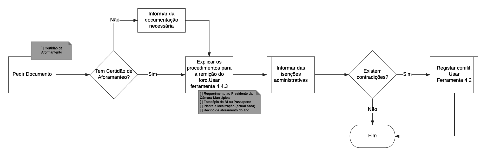
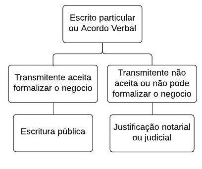
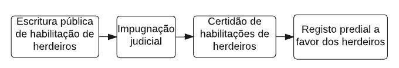
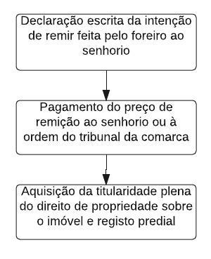
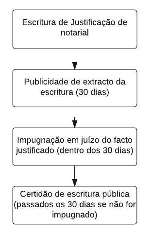
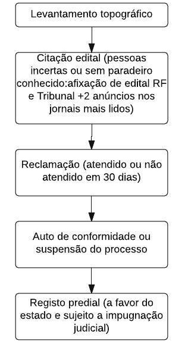

## Ferramentas Legais {#ferramentas-legais}

### Ferramenta 1 – Recolha de dados e caracterização jurídica do prédio {#ferramenta-1-recolha-de-dados-e-caracteriza-o-jur-dica-do-pr-dio}

A caracterização da situação jurídica do prédio trata essencialmente de determinar ou clarificar, mediante prova documental (certidões do registo predial e/ou inscrição matricial ou outros títulos jurídicos válidos de aquisição) o titular ou os titulares do direito ou dos direitos sobre um determinado prédio fisicamente identificado. Contribuem directamente para esta tarefa:

1.  O(a)s técnico(a)s do backoffice, ao harmonizar os processos e verificando se precisam ser complementados;
2.  O(a) jurista(a) e técnico(a) social, analisando as questões de direitos e limites e indicando informações ou evidências em falta (identificando inclusivamente as acções necessárias em casos que requerem formalização).

A análise é feita com base nos dados recolhidos pelo(a) inquiridor(a) durante a visita de campo: este(a) solicita ao declarante os documentos que este tem (documentos de identificação pessoal - tais como o BI, passaporte, NIF) e da casa (os que o titular tiver) e fotografá-los (digitalizar); também preencher com o declarante a Declaração de Titularidade (questionário digital). De referir que o(a) inquiridor(a) que trabalha em seções cadastrais onde existem assentamentos informais (AUGI e não AUGI) deve ter uma formação mais aprofundada sobre os dados a recolher nestas situações.

Para todos os titulares os **contactos** (completos e bem anotados), o que permitirá ao backoffice e/ou gabinete de apoio voltar a entrar em contacto com o titular para (i) completar processos incompletos (ou com inconsistências identificadas na harmonização), (ii) apoiar o processo de formalização dos direitos que se revelarem informais.

O prédio tem sempre um titular do direito de propriedade ou cotitulares e, eventualmente, pode ainda estar onerado por algum dos outros direitos reais secundários contemplado nas Operações do Cadastro Predial, que são:

Usufruto: gozo temporário e pleno sem alteração de forma ou substância;

Aforamento: com direito de propriedade desmembrado em domínio direto para o senhorio e domínio útil para o foreiro;

Direito de superfície: construir ou manter, temporal ou perpetuamente, uma obra ou exploração em terreno alheio;

Servidão predial: encargo imposto a um prédio (dominante) em proveito exclusivo de outro (serviente) pertencente a dono diferente;

Concessão administrativa: prédios públicos usados ou ocupados, a título precário, mediante licença ou autorização administrativa.

Posse com as características legalmente relevantes para a aquisição do direito de propriedade, em que se enquadram situações diversas de direitos não formalizados.

As seguintes informações devem em particular ser recolhidas/compiladas/analisadas:

| Informações | Observações |
| --- | --- |
| Data de aquisição do prédio / direito |  |
| Estado civil na altura da aquisição | Incluindo a existência de união de fato nessa altura, o que implica recolher o nome do convivente e informar os titulares quanto à necessidade de reconhecimento da união – mesmo que já terminada, ou de optar por outra forma de constituição de compropriedade. |
| Modo de aquisição do prédio | Por exemplo por herança, compra e venda, doação, etc. |
| Como foi concretizada a aquisição | Por exemplo, mediante escritura pública, contrato particular ou verbal, contrato de aforamento, etc. |

No caso de propriedade horizontal, verificar existência de administrador (já que o Regime Especial prevê que estes possam assinar a declaração de titularidade em nome dos condóminos, se tiver informações para o efeito).

As evidências dependem do direito em questão, há que verificar se as evidências necessárias constam do processo:

| Direito | Evidências |
| --- | --- |
| Propriedade | Certidão de casamento ou de união de fato / sentença de divórcio |
| Aforamento | Certidão de casamento ou de união de fato / sentença de divórcio |
| Usufruto, direito de superfície, concessão administrativa | Certidão de casamento ou de união de fato / sentença de divórcio (pessoas singulares) |
| Servidão predial | Depende de verificação de necessidade |
| Posse com características legalmente relevantes para a aquisição do direito de propriedade | Situações diversas de posse com direitos não formalizados. Os documentos **a tratar** dependem do modo de aquisição /direito. São documentos a tratar (mais do que evidências a recolher), já que os prédios ficam com esta classificação de direito precisamente por não haver evidências que permitem demonstrar o direito em questão, existindo apenas presunção. Por exemplo: |

De seguida é exemplificado o fluxo geral da aquisição para caracterização jurídica do prédio, sendo logo de seguida detalhadas as situações mais frequentes, que são as de transmissão inter-vivos, transmissão mortis causa e aforamento.

Figura 65 - Procedimentos para recolha de informações relativas a atos inter vivos

Figura 66 - Ferramenta para recolha de dados para a caracterização jurídica do prédio

Figura 67 - Procedimentos para recolha de informações relativas a atos mortis causa

Figura 68 - Procedimentos para recolha de informações relativas ao aforamento

### Ferramenta 2 - Identificação de conflito {#ferramenta-2-identifica-o-de-conflito}

Tendo em conta as evidências recolhidas na fase de preparação da operação e na fase de aquisição dos dados cadastrais, devem ser identificados/assinalados pela equipa do terreno e pelo backoffice os conflitos emergentes do direito de propriedade e outros direitos reais secundários sobre bens imóveis, s Toda a gestão posterior dos conflitos – identificação definitiva e encaminhamento adequado para a sua resolução extrajudicial ou judicial - será realizada pelo BackOffice e pelo Gabinete de Apoio.

Tabela 11 - Identificação de Conflito

| Situação identificada | Medida Recomendada | Tipologia do Conflito |
| --- | --- | --- |
| Duplo Registo Predial | Esclarecimentos personalizados | Conflitos quanto à titularidade de direito |
| Dupla inscrição matricial |  |  |
| Contradição entre a matriz e o registo predial |  |  |
| Contradição entre inscrição predial e/ou matricial e posse |  |  |
| Prédio omisso no(a) registo / matriz |  |  |
| Divergência de área entre evidências (registo matricial, predial, titulo aquisitivo, etc.) e levantamento em campo, mas apenas quando há oposição dos confinantes | Informar do procedimento de Demarcação na presença de todos os confinantes | Conflitos quanto aos limites físicos do prédio |
| Sobreposição com os limites do (s) prédio (s) confinante (s) |  |  |
| Ato de transmissão de propriedade registada em nome do Estado pelo Município a um Particular | Esclarecimentos personalizados | Conflitos referentes a terrenos do domínio privado do Estado vendido pelos municípios |
| Construção sem loteamento | Esclarecimentos personalizados | Conflitos relativos a construções clandestinas e ilegais em terreno alheio ou zonas de risco |
| Duplo Registo Predial em nome do Estado e de Expropriado | Esclarecimentos personalizados | Conflitos provocados pela expropriação por utilidade pública sem pagamento da indemnização |

### Ferramenta 3 - Apoio para Emissão de Parecer {#ferramenta-3-apoio-para-emiss-o-de-parecer}

A situação dos imóveis deve ser refletida no cadastro predial tal como indica a Tabela seguinte, apoiando a EE e a EAT na análise e preparação de pareceres. Esta tabela pretende ser meramente indicativa, apontando as situações _tout court_, sem atender à multiplicidade de evidências que podem se verificar. O registo de imóveis do Estado e das Autarquias locais, deve, não se verificando contradições outras relacionadas com o registo matricial / predial / posse, ser realizado em nome do Estado/Município.

Tabela 12 - Apoio para Emissão de Parecer

| Situação Identificada | Instrução para Qualificação |
| --- | --- |
| Terrenos do domínio público/privado do Estado | Inscrição em nome do Estado |
| Terrenos do domínio público do Estado (ex. orla marítima, salinas, etc.) cedidos a particular pelas autoridades públicas | Inscrição em nome do particular e desafectação do domínio público do Estado |
| Terrenos do domínio público do Estado atribuídos a Particulares mediante licença/concessão administrativa | Inscrição em nome do Estado e do particular licenciado/concessionado |
| Terrenos/imóveis do domínio público/privado do Município | Inscrição em nome do Município |
| Terrenos do domínio público do Município atribuídos a Particulares mediante licença/concessão administrativa | Inscrição em nome do Município e do particular licenciado/concessionado |
| Ocupação/edificação clandestina em Terreno público do Estado | Inscrição em nome do Estado |
| Ocupação/edificação clandestina em Terreno privado do Estado não cumprindo critérios para usucapião | Inscrição em nome do Estado |
| Ocupação/edificação clandestina em Terreno privado do Estado cumprindo critérios para usucapião | Inscrição em nome do possuidor |
| Ocupação/edificação clandestina de Terreno público do Município | Inscrição em nome do Município |
| Ocupação/edificação clandestina de Terreno privado do Município não cumprindo critérios para usucapião | Inscrição em nome do Município |
| Ocupação/edificação clandestina de Terreno privado do Município cumprindo critérios para usucapião | Inscrição em nome do possuidor |
| Terreno expropriado sem pagamento de indemnização | Inscrição em nome do expropriado |
| Herança Jacente | Inscrição em nome do cônjuge meeiro e/ou dos herdeiros |
| Contradição entre Registo Predial e Matricial | Inscrição em nome do titular do Registo Predial, sem prejuízo da posse |
| Duplicidade de Registo Predial | Inscrição em nome do Titular do Registo Prioritário |
| Contradição entre Registo Predial e Posse anterior | Inscrição em nome do Possuidor, se justificada a posse |
| Contradição entre Registo Matricial e Posse anterior | Registo em nome do Possuidor, se justificada a posse |
| Prédio Omisso no Registo Predial e Inscrito na Matriz | Inscrição em nome do titular do registo matricial |
| Aforamento | Inscrição em nome do senhorio e do foreiro |

Adicionalmente, ao analisar a situação do prédio e ao emitir o parecer, torna-se necessário sistematizar os **motivos de cadastro diferido** para os prédios que se encontram nesta situação. Esta indicação em campo próprio vai facilitar o trabalho de formalização, já que aponta claramente qual a acção de formalização necessária para cada caso, ao mesmo tempo que fica claro as instituições que devem estar envolvidas nesse trabalho de formalização, em estreita concertação com a EE.

A tabela que se segue mostra os motivos de cadastro diferido que estão atualmente parametrizados no sistema (LMITS), sendo possível acrescentar novas tipologias sempre que na prática surjam. De referir que são ainda assinaladas algumas situações que carecem de atenção, apesar de não estarem em cadastro diferido (ex. união de fato não reconhecida mas reconhecível em que o bem imóvel é um bem comum; situação de herdeiros em que ainda não foi feita habilitação de herdeiros e/ou partilha, já que, apesar do prédio poder ser inscrito no cadastro predial em nome de “_Herdeiros de…_”, sem a habilitação de herdeiros e/ou escritura de partilha o Registo predial não poderá ser feito.

Tabela 13 - Motivos para cadastro diferido - tipologias

| Tipologia de Cadastro Diferido | Detalhes |
| --- | --- |
| Falta de definição jurídica da titularidade | Não existem evidências que indicam/ fazem presumir quem é o titular, nem qual o direito |
| Falta de dado de declaração obrigatória | Ausência cumulativamente de documento de identificação (BI ou passaporte) e NIF |
| Necessidade de harmonização de dados |  |
| Não formalização do direito por falta de escritura pública de compra e venda | Quer seja uma compra à Câmara Municipal, em que existe alvará, quer seja a privado |
| Não formalização do direito por falta de escritura pública de doação |  |
| Não formalização do direito por falta de escritura pública de permuta |  |
| Não formalização do direito por falta de escritura pública de justificação notarial ou justificação judicial | Por exemplo em situações de aquisição por usucapião, mas também de indisponibilidade de vendedor quando não existe escritura pública de compra e venda |
| Não formalização por falta de instrumento de ratificação do negócio | Contrato |
| Condição suspensiva de contrato por cumprir | Por exemplo habitação social cedida pela Câmara a título de contrato de tipo renda resolúvel (quando montante total for pago, está cumprida a condição suspensiva e há direito de propriedade) |
| Não formalização de direito por falta de escritura pública de concessão administrativa |  |
| Aforamento sem contrato de aforamento |  |
| Falta de justificação administrativa de domínio | No caso do Estado |
| Processos judiciais pendentes |  |
| Conflitos quanto à titularidade de Direitos |  |
| Conflitos quanto aos limites físicos do prédio |  |
| Conflito de fato sobre limites - sobreposição de polígonos - e possível necessidade de reassentamento ou realojamento | Por exemplo situações (de fato) de assentamento informal, em parcelas com ou sem restrições administrativo-legais ou ambientais |
| Conflito de fato sobre o uso ou direitos sobre a propriedade e possível necessidade de reassentamento ou realojamento | Por exemplo situações (de fato) de assentamento informal, em parcelas com ou sem restrições administrativo-legais ou ambientais |
| Conflitos referentes a terrenos do domínio provado do Estado vendido pelos municípios |  |
| Conflitos provocados pela expropriação por utilidade pública sem pagamento da indemnização |  |
| Conflitos em vista da ocupação de terrenos do domínio público |  |
| Conflitos provocados pelo recurso ilegal a justificação judicial notarial e administrativa de prédios |  |
| Outras situações |  |
| Situações que não ficam em cadastro diferido, mas requerem atenção para que todos os direitos em presença sejam reconhecidos e/ou para viabilizar o Registo Predial |
| Falta de reconhecimento da União de Facto |  |
| Falta de Habilitação de Herdeiros |  |
| Outras situações |  |

### Ferramenta 4 - Procedimentos para formalização e consolidação de direitos {#ferramenta-4-procedimentos-para-formaliza-o-e-consolida-o-de-direitos}

#### Reconhecimento do direito sobre imóveis adquiridos por escrito particular ou por acordo verbal {#reconhecimento-do-direito-sobre-im-veis-adquiridos-por-escrito-particular-ou-por-acordo-verbal}

Nos casos de aquisição informal do direito, o titular cadastral deve recorrer aos meios de provas legalmente admissíveis em direito.

Caso a aquisição tenha sido feita à Câmara, conforme demonstrado pelo alvará/comprovativo de compra, a escritura pública é elaborada pelo Notário privativo da Câmara. O mesmo se aplica a bens imóveis adquiridos ao Estado.

Caso o bem imóvel tenha sido adquirido a um privado, a transacção deve ser formalizada, mediante escritura pública no Cartório Notarial, para que o titular a possa ver registada na Conservatória do Registo Predial.

Para o efeito, o presumível titular deve propor ao transmitente a formalização do negócio. No caso de impossibilidade ou recusa deste, deve recorrer ao Cartório Notarial para proceder à Justificação Notarial ou recorrer aos Tribunais Judiciais para proceder à Justificação Judicial.

Figura 69 - Formalização de direitos - Imóveis transaccionados por escrito particular/acordo verbal

#### Habilitação Notarial de Herdeiros   {#habilita-o-notarial-de-herdeiros}

A habilitação notarial de herdeiros é realizada no Cartório Notarial e consiste na declaração, feita em escritura pública por três pessoas que o notário considere dignas de crédito, de que os habilitandos são herdeiros do(a) falecido(a) e não há quem lhes prefira na sucessão ou quem concorra com eles. A declaração referida no número anterior pode ser feita, em alternativa, por quem desempenhar o cargo de cabeça-de-casal, devendo, nesse caso, ser-lhe feita a advertência prevista no artigo 97º.

A declaração deve conter a menção do nome completo, do estado civil, da naturalidade e da última residência habitual do autor da herança e dos habilitandos.

A escritura de habilitação deve ser instruída com os seguintes documentos:

Certidão narrativa de óbito do autor da herança;

Certidão de nascimento, justificativos da sucessão legítima, quando nesta se fundamente a qualidade de herdeiro de algum dos habilitandos;

Certidão de teor do testamento ou da escritura de doação por morte, mesmo que a sucessão não se funde em algum desses atos.

A certidão de habilitação de herdeiros notarial (obtida findo o período de publicitação (editais) do extrato da habilitação e não havendo contestação) tem os mesmos efeitos da habilitação judicial - requerida nos tribunais - e é título bastante para que se possam fazer em comum, a favor de todos os herdeiros e do cônjuge meeiro, o registo dos imóveis nos serviços do registo predial, que pode ser requerido por qualquer dos herdeiros habilitados ou pelo cônjuge meeiro.

Figura 70 - Procedimento para habilitação de herdeiros

#### Remição do foro   {#remi-o-do-foro}

Havendo pedido do foreiro nesse sentido, a Câmara Municipal promove durante a Operação ou no término desta, a remição do foro a favor dos foreiros dos lotes de terrenos a cadastrar ou cadastrados que tenham sido concedidos em regime de aforamento e no qual tenha sido construído ou esteja em construção prédio urbano.

Podem igualmente serem remidos, o foro de terrenos sob os quais ainda não tenha sido edificado, desde que o foreiro comprove mediante documentos (projecto de construção aprovado, empréstimo bancário, demonstração de meios para construção) a sua intenção de edificar a habitação própria no terreno.

O preço da remição será pago em dinheiro e corresponderá a vinte vezes o foro anual vencido. O foreiro pode optar pelo pagamento do preço da remição no máximo de vintes prestações anuais, declarando-o por escrito ao senhorio. A mora no pagamento de qualquer das prestações implica o pagamento da mesma em dobro, mas não o vencimento da totalidade do preço da remição.

Com o pagamento integral dos foros, atribui-se o direito de propriedade ao então foreiro, e a remição fica sujeita ao registo predial obrigatório, que deve ser promovido pela Câmara Municipal e pela EE.

O registo predial obrigatório da remição de foro está isento de emolumentos notariais e de registo.

Figura 71 - Procedimentos para remição de foro (aquisição de pleno direito)

#### Justificação Notarial {#justifica-o-notarial}

A justificação notarial é o principal instrumento utilizado pelos privados para a justificação do direito mas só se pode recorrer a ela quando haja inscrição matricial do direito a favor do justificante ou da pessoa de quem adquiriu o direito. A justificação notarial é realizada por escritura pública no Cartório Notarial, perante o Notário e são passadas depois de decorridos 30 dias sobre a data em que o extrato for publicitado se dentro desse prazo não for recebida comunicação da pendência da impugnação.

A escritura de justificação é publicada, por meio de extrato do seu conteúdo, afixado em editais, no prazo de quinze dias, a contar da data em que tiver sido outorgada.

O facto justificado na escritura pode ser impugnado em juízo por interessados devendo requerer simultaneamente ao tribunal a imediata comunicação ao notário da pendência da ação.

Só podem ser passadas certidões de escritura de justificação depois de decorridos 30 dias sobre a data em que o extrato for publicado, se dentro desse prazo não for recebida comunicação da pendência da impugnação.

Figura 72 - Procedimentos para formalização de direitos – Justificação Notarial

#### Justificação Judicial {#justifica-o-judicial}

Sempre que não seja possível recorrer à justificação notarial, designadamente por omissão do prédio na matriz, a favor do justificante ou do transmitente, pode-se recorrer à justificação judicial intentando uma ação de justificação judicial junto dos tribunais judiciais através de petição dirigida ao juiz. Para intentar a ação de justificação judicial é obrigatória a constituição de advogado.

O juiz é livre para apreciar as provas. Pode ouvir testemunhas ou mandar realizar diligências probatórias que entender oportunas.

Figura 73 - Procedimentos para formalização de direitos – Justificação judicial