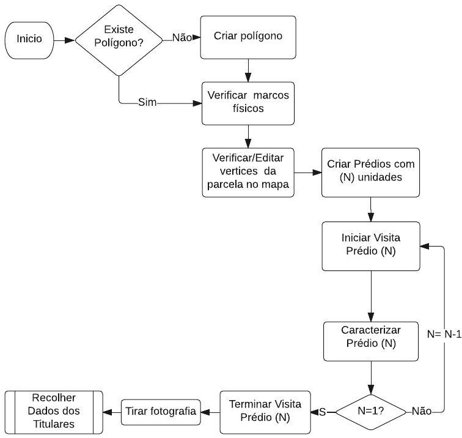
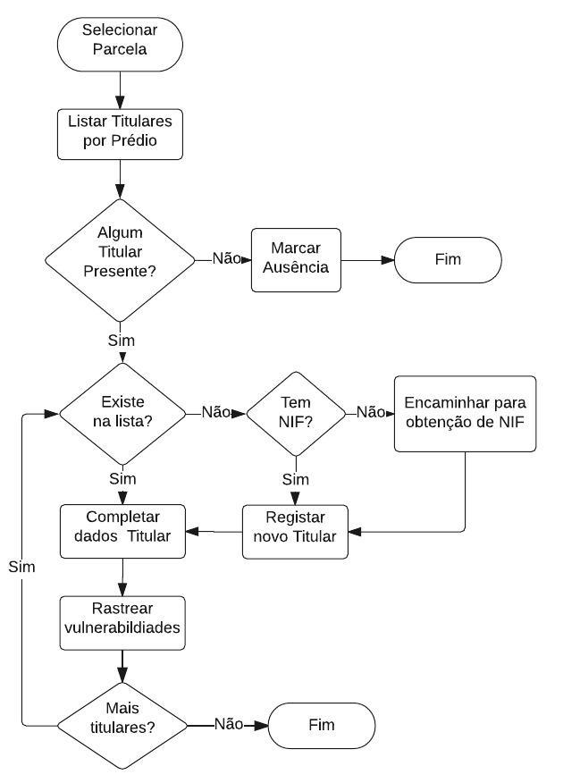
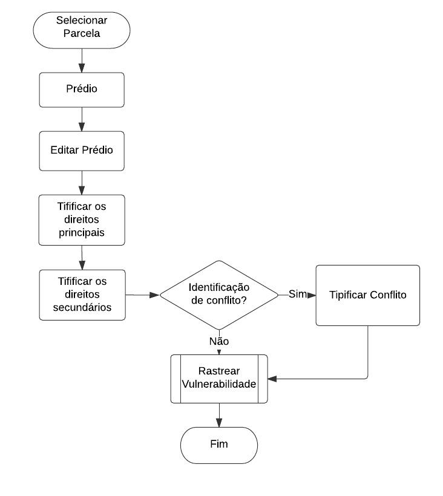
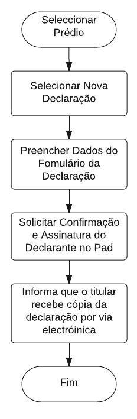
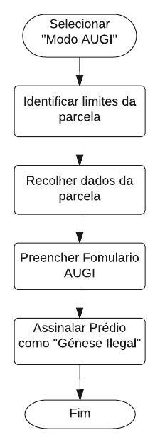
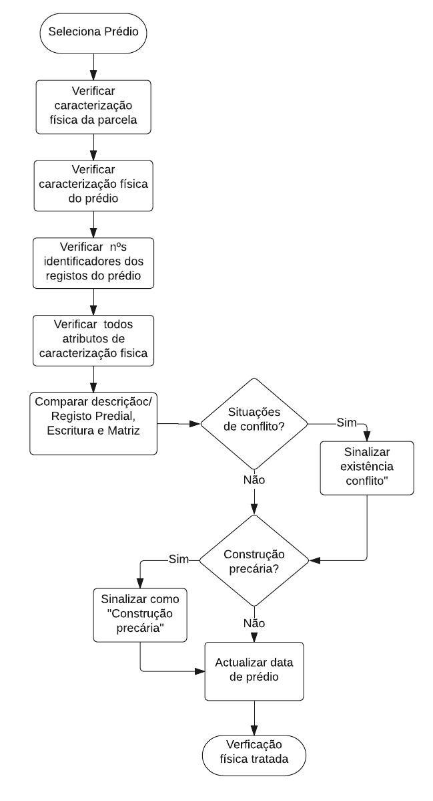
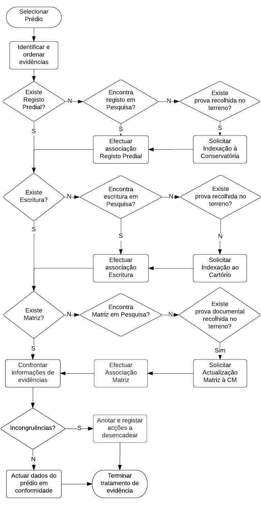

## Aquisição de Dados Cadastrais {#aquisi-o-de-dados-cadastrais}

A aquisição de dados cadastrais consiste e é apresentada nas seguintes secções:

*   Revisão e sistematização das informação, incluindo o tratamento das evidências e restrições;
*   Trabalho de campo;
*   Harmonização de dados recolhidos;
*   Retificação de Declarações.

Figura 22 - Aquisição de Dados Cadastrais

Cada um dos procedimentos é descrito seguidamente:

### Revisão e Sistematização da Informação {#revis-o-e-sistematiza-o-da-informa-o}

Em função dos sectores cadastrais é necessário rever e sistematizar a informação existente por forma a conseguir planear as intervenções de campo e etapas subsequentes.

Esta etapa consiste na verificação de polígonos (parcelas) existentes no sector recorrendo a informação disponível na Câmara Municipal, na existência de registos das bases de dados existentes associados a essa parcela, bem como da relação temporal existente entre esses registos.

Consiste ainda na contextualização do sector e das parcelas nelas contidas do ponto de vista ambiental e de eventuais restrições de uso e do ponto de vista social.

No fim desta sistematização deve ser possível classificar com clareza qual o tipo de sector em causa e adotar a melhor abordagem de terreno e de _BackOffice_, aferindo o esforço necessário para a operação do cadastro bem como o tipo de comunicação e agentes de proximidade a adotar.

No final desta revisão e sistematização, que passa pelo tratamento das evidências, identificação de restrições identificação de potenciais conflitos, e identificação de vulnerabilidades sociais e de género, obtém-se uma classificação do sector quanto à sua tipologia de execução (temos de definir melhor os critérios e o por exemplo: urbano vs. rural, vulnerável vs. não vulnerável, com riscos e restrições vs. sem restrições, existência de evidências vs. informalidade, etc…)

### Tratar Evidências {#tratar-evid-ncias}

Âmbito

Para cada sector, verificar e tratar as evidências associadas aos polígonos, pesquisando e associando as bases de dados atualmente existentes, matriz predial e alvarás da Câmara Municipal, escrituras e registo predial da DGRNI e ainda património do estado no sentido de perceber qual o grau das evidências existentes e se é possível melhorar em determinados casos a situação atual.

Para as evidências já associadas, garantir para cada parcela a perceção temporal dos factos ocorridos e por conseguinte, perceber quem são os titulares ativos já conhecidos.

Podendo este processo ocorrer em etapas posteriores, verificar ainda se existem declarações de titularidade associadas aos prédios que neste contexto também são tratados como evidências relevantes.

No final de este processo de triagem pretende-se que a atividade de campo subsequente possa ter acesso ao maior número de evidências possíveis associadas aos prédios (parcela ou construções nela contidas).

Finalidade

Preparar as evidências de cada parcela para o trabalho de campo de modo a aferir a atual titularidade e se existem ou não restrições aos direitos.

Intervenientes

EE (Analistas Juristas, para-juristas, informáticos);

Câmara Municipal;

Conservatória do Registo Predial e Cartório Notarial.

Diagrama

Figura 23 - Tratar evidências

Sequência típica

Para cada parcela, e para cada prédio/fração o analista deve:

1.  Começar identificar quais as evidências presentes: polígonos, Declaração de Titularidade, registo matricial, alvará, escritura pública, ou outro documento que esteja associado (digitalização de evidência resultante de uma iniciativa da EE ou do declarante);

Ordenar as evidências pela data dos factos ou do registo, de modo a apurar a cronologia dos factos e apurar a última caracterização predial e respetiva titularidade; se esta funcionalidade não estiver disponível no sistema, a triagem deve ser feita fora do sistema.

Em função da análise efetuada, sinalizar no sistema para tratamento posterior qual a evidência mais relevante a ter em conta em trabalho de campo; se esta funcionalidade não estiver disponível no sistema, a sinalização deve ser feita fora do sistema (folha de gestão de processos).

No caso das declarações que indiciem um potencial conflito, sinalizar a proposta/prédio com a flag “em conflito” e anotar na respetiva página, a tipologia do conflito identificado;

Anotar no respetivo prédio, na página de ações, que medidas devem ser encadeadas no sentido de se obter evidências adicionais (por exemplo, existe um registo com base em escritura pública, mas essa escritura não está no sistema, mas existe!);

Tipificar que o prédio está em regime de propriedade horizontal se houver evidência matricial, notarial ou de registo predial; Gerar as respectivas frações da propriedade horizonal e repetir o procedimento Tratar Evidências para cada fração.

Anotar no respetivo prédio, se existe a necessidade de especial atenção no trabalho de campo.

### Caracterização das seções cadastrais do ponto de vista ambiental e de restrições administrativo-legais {#caracteriza-o-das-se-es-cadastrais-do-ponto-de-vista-ambiental-e-de-restri-es-administrativo-legais}

Âmbito

Uma dimensão fundamental da preparação do trabalho de levantamento cadastral é a caracterização das seções cadastrais, ou seja identificar que restrição (ou quais) afectam que blocos. De acordo com as restrições seleccionadas (com base no estudo prévio das restrições relevantes) e com base nos respectivos _layers_ introduzidos no sistema, trata-se de verificar se, em determinadas seções cadastrais, existem condicionantes à titularidade e/ou aos usos autorizados para determinadas parcelas do bloco cadastral.

A utilização de ferramentas de análise espacial com o suporte de SIG diminuem consideravelmente o nível de subjetividade do processo, uma vez que permitem ter uma visão integrada dos planos de informação (temas/camadas) selecionados, possibilitando assim a visualização das parcelas que cabem dentro de cada _layer_ de restrição.

Ao analisar os _layers_ que incidem sobre cada bloco cadastral, as informações devem ser sistematizadas com base na **ferramenta de caracterização ambiental e das restri**ções **administrativo-legais** (Ferramenta AMB 1): a ferramenta permite listar todos as condicionantes em presença num determinado bloco cadastral. Quando os polígonos já se encontram no sistema, é ainda possível quantificar o número de polígonos sujeitos a algum tipo de restrição. A informação geoespacial disponível no sistema LMITS permite esta análise (ex. parcelas/polígonos existentes, imagens áreas recentes, condicionantes uso do solo, áreas protegidas, riscos naturais, orla marítima, servidões, rede rodoviária existente, zonas de jurisdição portuária, servidões aeronáuticas, servidões militares, zonas de desenvolvimento de energias renováveis, ZDTI e ZDRT etc.).

Esta listagem será a base para a verificação no terreno dos usos dados da parcela, permitindo analisar se são compatíveis ou não com as restrições que incidem sobre a parcela. Mesmo quando o uso é compatível no presente (ex. não foi edificada habitação, em zonas em que não é permitida habitação, etc.), a anotação da restrição no Cadastro Predial deve constar, para ser respeitada no futuro, contribuindo para caracterizar dos cenários prospectivos do uso da terra.

NOTA: caso os _layers_ não existam no sistema (LMITS), esta análise é feita com recurso a ferramentas SIG, fora do LMITS. Pode-se utilizar o programa ARCGIS ou outra ferramenta GIS, realizando as mesmas acções da sequência típica _online_.

Finalidade

Identificar as restrições administrativas-legais e ambientais que afectam cada bloco cadastral e, quando possível, quantificar o número de polígonos afectados no sistema LMITS.

Condições de partida

Existem os mapas temáticos de informação carregados no sistema (tendo em conta restrições e seus subníveis).

Quando possível existem polígonos no sistema.

Existem layers de informação administrativas (seções cadastrais).

Intervenientes

EE (Analista SIG, técnico ambiental, jurista).

Diagrama

Figura 24 - Caracterizar as restrições de cada bloco cadastral

Sequência típica

Para cada bloco cadastral o analista deve:

Selecionar os _layers_ de restrições;

Avaliar os blocos de acordo com as condicionantes existentes;

Anotar os polígonos afectados por cada restrição relevante (quando existem polígonos no sistema); ex. pela área de servidão aeroportuária (zonas de maior risco), área de proteção, área de risco/ segurança pública, etc.;

Caso os polígonos não existam ou venham a ser delimitado posteriormente, a informação vai aparecer em todos os prédios abrangidos pelo _layer_, de acordo com os _layer_s selecionados.

Fluxogramas

Figura 25 - Fluxograma Identificação de restrições ambientais

Pós-Condições

Mapeamento das restrições a ter em conta durante o trabalho de levantamento, por bloco cadastral (quais as servidões e que zonas especificas destas devem, do ponto de vista cadastral – direitos e usos da terra, ser assinaladas, para o presente e para o futuro).

Listagem dos polígonos afetados pelas diferentes restrições (quando pré-existem no sistema).

### Identificar as Necessidades e Planificar Comunicação e Sensibilização de Proximidade {#identificar-as-necessidades-e-planificar-comunica-o-e-sensibiliza-o-de-proximidade}

Âmbito

Do ponto de vista da comunicação, é fundamental a contextualização socioeconómica das várias seções/blocos cadastrais: havendo clareza quanto às características da seção/bloco cadastral em causa, poderá melhor ser aferido o tipo de comunicação e agentes de proximidade a prever.

De forma muito específica, há que considerar os grupos mais vulneráveis e excluídos, que podem necessitar de abordagens específicas, esclarecimentos adicionais e acompanhamento para garantir a sua efetiva participação.

Finalidade

Planificar as necessidades de comunicação de proximidade em concertação com a equipa de terreno, para ajustar o tipo de comunicação e agentes de proximidade às características das secções cadastrais.

Interveniente

EE, equipa de terreno, núcleo/equipa de comunicação.

Condições de partida

Diagnóstico social e de género; análise das partes interessadas; núcleo/equipa de comunicação criado.

Sequência típica

1.  A equipa de terreno e a equipa de comunicação identificam as áreas de concentração de grupos vulneráveis, áreas em situação de precariedade legal, AUGI, que necessitarão de atenção especial para o esclarecimento de direitos, recolha de informação para possível regularização;

Identificam outras zonas de concentração de pessoas com características específicas (ex. nas ilhas turísticas, zonas de concentração de residentes não nacionais, zonas urbanas residenciais, etc.);

Com base neste mapeamento, planifica os meios necessários para a sensibilização de proximidade, incluindo a identificação de técnicos adicionais que devem acompanhar a equipa (ex. técnicos da Câmara Municipal no caso das AUGI, etc.);

Define para cada bloco/secção cadastral os grupos alvo, o tipo de ação de sensibilização, temática (s) a abordar, objetivos/ resultados esperados.

Pós-Condições

Para um dado sector cadastral está identificado e registado no sistema qual o perfil de comunicação/sensibilização que parece mais adequado.

### Trabalho de Campo {#trabalho-de-campo}

Em campo, faz-se a verificação e recolha da informação sobre cada parcela/prédio, do (s) seu (s) respetivo (s) titular (es) e direitos existentes, para que se forme uma base cadastral. A informação recolhida tem duas principais componentes: **alfanumérica** (complementada com a recolha de documentos, referido anteriormente) e **geográfica**. Nas secções seguintes irá falar-se destas componentes com maior detalhe.

Figura 26 - Trabalho de campo

#### Sensibilização e comunicação {#sensibiliza-o-e-comunica-o}

Âmbito

A boa compreensão dos objetivos da operação de cadastro, e seus impactos previstos, é fundamental para garantir uma adesão generalizada ao registo sistemático, e para evitar que a perspetiva da realização da operação ative ansiedades e tensões, potencialmente desencadeadoras de conflitos e agudizadora dos já existentes. Há que garantir que durante o trabalho de campo as populações estão preparadas para receber as equipas, e que tanto estas como as instituições titulares cadastrais conhecem o tipo de informações que vão ser recolhidas durante a visita e tiveram assim ocasião de preparar as informações/documentos necessários.

Por outro lado, há que ter em conta que os grupos mais vulneráveis e excluídos podem necessitar de abordagens específicas, esclarecimentos adicionais e acompanhamento para garantir a sua efetiva participação. Por outro lado têm maior probabilidade de se encontrar em situação de precariedade legal e riscos e precisar de informação jurídica ou de meios de resolução de conflitos. Neste sentido haverá que divulgar os serviços de apoio disponíveis.

Finalidade

Informar sobre a operação, em particular o trabalho de campo, mediante informações detalhadas e claras, e divulgar os meios de apoio existentes, com enfoque nos grupos mais vulneráveis, para informar, esclarecer, assessorar juridicamente, apoiar na resolução de conflitos, utilizando o perfil de comunicação previamente identificado na preparação (ou adequar).

Intervenientes

Entidade Executante (Equipa de terreno, núcleo/equipa de comunicação criado, incluindo especialista de comunicação e técnicos/agentes comunitários conhecedores da realidade local, ONG e associações).

Diagrama

Figura 27 - Sensibilização e Comunicação

Condições de partida

Estratégia de comunicação e plano; _branding_, incluindo identificação da equipa de cadastro; produtos comunicacionais elaborados; agentes de sensibilização capacitados e disponíveis (com enfoque nos que possuem confiança no seio da comunidade, em particular as comunidades mais vulneráveis).

Sequência típica

1.  A equipa de comunicação divulga, em coordenação com a equipa de terreno, o programa de deslocação ao campo;

Organiza sessões de informação/esclarecimento a nível local, com enfoque na recolha de dados a ser realizadas durante a visita de terreno: informação da declaração (dados pessoais dos titulares, cotitularidade, historial da parcela), na demarcação das parcelas (procedimentos e prazos - antes da visita, durante o trabalho de campo e até 20dias úteis antes do término da operação de cadastro), etc.;

Estimular a presença de todas as partes interessadas no momento da demarcação dos terrenos: vizinhos que compartilham limites do prédio (os confinantes), ambos os cônjuges, conviventes em união de facto, que podem ter interesses comuns em terrenos ou propriedade, etc.;

Organizar eventos e distribuir materiais informativos;

Mantém as atividades de campanha nos meios de comunicação social e de massas para a mobilização dos diversos alvos e o seu engajamento aos objetivos da operação;

Planifica atividades de porta-a-porta, conversas comunitárias, debates por via de rádio comunitária, radio praça, etc.;

Coordena as visitas com técnicos de instituições pertinentes, que possam acompanhar a sensibilização/visita nas zonas previamente identificadas (AUGI ou outras);

Divulga os serviços de apoio existentes, com enfoque nos mais vulneráveis (informação jurídica, serviço de conciliação e mediação);

Organiza consultas pós-visita, uma vez acabada a visita de terreno, para recolha de feedback e introduz ajustes na metodologia para as atividades de sensibilização nas seções/blocos cadastrais seguintes;

Para os empreendimentos turísticos deve ser feito um evento dedicado, em parceria com a Autoridade Turística Central e Câmara de Turismo, para apresentação do projecto e dos seus objetivos. Nesse encontro fala-se das especificidades da recolha, tratamento, assinatura de pareceres, e emissão de pareceres.

#### Rastreio Social e de Género na Visita de Terreno {#rastreio-social-e-de-g-nero-na-visita-de-terreno}

Âmbito

Antes de iniciar a caracterização física do prédio e direitos associados, é importante saber se as pessoas que vão ser abordadas estão em situação de vulnerabilidade. A utilização de uma ferramenta simples de rastreio vai permitir aferir a situação, alertando a equipa de terreno para (i) a possibilidade de ter de adaptar as informações e esclarecimentos que vai prestar, para garantir que a boa compreensão de alguns procedimentos específicos (demarcação, preenchimento da Declaração de Titularidade), e também o entendimento dos procedimentos na sua totalidade, para que as pessoas em situação de vulnerabilidade compreendam a necessidade de completar a documentação requerida para a clarificação de direitos e limites, e subsequente registo predial; (ii) a necessidade em certos casos de apoio para a realização de procedimentos (demarcação, Declaração de Titularidade); (iii) a necessidade de possíveis encaminhamentos para serviços de apoio mais diferenciados, através de um acompanhamento pelo responsável pelas questões sociais e de género, pelo para-legal ou outros, através do Gabinete de Apoio.

Finalidade

Identificar se as pessoas em presença estão em situação de vulnerabilidade.

Intervenientes

EE, equipa de terreno;

ONG e associações;

Titular.

Condições de partida

Existe pelo menos um titular ou representante

Ferramentas:

Ferramenta ASG 3 - Rastreio social de género na visita de terreno.

Ferramenta ASG 4 - Ficha de seguimento das pessoas vulneráveis do ponto de vista social/género.

Sequência típica do procedimento

1.  O **inquiridor** utiliza a ferramenta de rastreio para verificar a pertença dos titulares/representantes dos agregados, ou da pessoa que vai prestar informações, a um dos seguintes grupos vulneráveis:
    1.  Analfabeto ou com menor grau de escolaridade;
    2.  Representante feminino;
    3.  Desempregado ou trabalhador sem remuneração;
    4.  Empregado em emprego sazonal/ocasional, doméstico, ocupação agrícola/piscatória;
    5.  Imigrante;
    6.  Portador de deficiência.

O **inquiridor** assinala ainda o estado civil do titular e, se for casado, estiver em união ou for separado/divorciado, assinala a necessidade de utilização da ferramenta respetiva (ferramenta ASG 4), a usar aquando da caracterização dos titulares;

A **equipa de terreno** adapta a prestação de informações e esclarecimentos à situação da pessoa;

A **equipa de terreno** utiliza a lista de verificação da ferramenta para assinalar qualquer preocupação a ter em conta (nota: esta lista de verificação pode ser utilizada em qualquer etapa);

De acordo com as necessidades, a **equipa de terreno** apoia na realização dos procedimentos das etapas que se seguem.

#### Recolher Dados da Parcela: Delimitação, Demarcação e Restrições {#recolher-dados-da-parcela-delimita-o-demarca-o-e-restri-es}

Âmbito

Este procedimento visa caracterizar fisicamente a parcela de terreno e as edificações nelas contidas. Consiste no reconhecimento dos limites da parcela ou no estabelecimento e clarificação de novos limites, corrigindo ou adicionando ao sistema os vértices que delimitam o polígono correspondente à parcela.

Além disso, também pretende recolher os dados físicos cadastrais e caracterizar a tipologia das construções nelas existentes, como sejam mero terreno, construção sem ou com propriedade horizontal, número de unidades existentes na parcela e espaços comuns.

É nesta caracterização física também que se vai aferir riscos ambientais ou vulnerabilidades aplicando as respetivas ferramentas de triagem previstas para esta etapa.

Após esta caracterização física feita pelo topógrafo, será possível classificar esta parcela e perceber que abordagem ter para a clarificação dos direitos associados.

E ainda durante esta caracterização podem surgir conflitos relacionados com a precisão das delimitações entre confinantes pelo que são também ativadas as respetivas ferramentas de identificação e tipificação de potenciais conflitos.

As Câmaras Municipais ficam obrigadas a demarcar ou fornecer informações sobre os limites ou extremas dos lotes de terreno para edificação urbana ou relativamente as quais concedeu por contrato, o direito de propriedade ou outro direito real mas que, até a data da execução do cadastro predial, não tenha sido objeto de implantação física.

Finalidade

Delimitação e Demarcação da parcela, sua caracterização física e construções nelas contidas.

Intervenientes

*   EE (Topógrafo);
*   Titular.

Diagrama

Figura 28 - Caracterização física da parcela

Fluxograma

Figura 29 - Caracterização física da parcela

Condições de partida

1.  Existe pelo menos um titular ou representante;

Existe um polígono no sistema correspondente à parcela;

As imagens ortorectificadas estão disponíveis no equipamento;

O sistema GNSS está operacional via RTK.

Ferramentas

1.  Tipologia de Conflito

Vulnerabilidade Social: Identificação de construção precária

Riscos Ambientais AMB2: Identificação de terreno ou construção em área de risco

Sequência típica do procedimento

1.  O **inquiridor** começa o procedimento utilizando o _Tablet_ para selecionar no mapa o polígono correspondente à parcela e escolhe a opção &lt;&lt;visita&gt;&gt;;

O **inquiridor** solicita ao (s) **titular (es)** que mostre os marcos (vértices) e limites da parcela;

Na presença do **titular,** o **inquiridor** verifica e/ou corrige os vértices do polígono recorrendo ao equipamento GNSS e/ou as imagens ortorectificadas e estabelece a configuração geométrica correta da parcela;

Se houver necessidade, pode editar cada vértice do polígono;

Se houver necessidade, podem ser adicionados ou eliminados vértices;

Para o polígono selecionado, o inquiridor escolhe a opção “caracterização do prédio”;

O sistema apresenta o formulário de caracterização já com alguns dados automaticamente preenchidos:

Localização administrativa;

Área da parcela.

Preencher ou corrigir os seguintes dados de caracterização da parcela:

Tipo de prédio (lote de terreno, prédio construído ou prédio em regime de propriedade horizontal);

Número de unidades administrativas (apenas 1 para terreno e para prédio que não esteja em propriedade horizontal).

Ao gravar o registo, o sistema irá criar um registo de &lt;&lt;proposta&gt;&gt; por cada unidade administrativa em função do tipo e número de unidades administrativas indicado, se estiver em regime de propriedade horizontal o sistema criará uma &lt;&lt;proposta&gt;&gt; adicional para a propriedade horizontal;

Escolher a opção &lt;&lt;propostas&gt;&gt; e o sistema apresenta a lista das &lt;&lt;propostas&gt;&gt; associadas a parcela;

Selecionar as propostas referentes às unidades visitadas e escolher a opção “Visita”. O sistema escreve a visita (timestamp e user);

Fotografar o prédio à frente da servidão principal do prédio; a imagem deve cobrir a máxima área do terreno ou volumetria das construções;

Para efeitos de controlo de qualidade, marcar com tinta os pontos utilizados para o levantamento;

Terminar o procedimento e seguir para a caracterização física da próxima parcela.

Sequências Excecionais

A1\. Não está presente nenhum titular ou representante =&gt; Tratar ausência

1.  Marcar &lt;&lt;ausência&gt;&gt; com um ponto georreferenciado num para-centróide da parcela;

No caso de algum testemunho de vizinho ou terceiro, registar no log da visita quem informou e o que informou;

Fotografar o prédio à frente da servidão principal do prédio; a imagem deve cobrir a máxima área do terreno ou volumetria das construções;

Terminar o procedimento.

A2\. Não está presente nenhum titular ou representante mas dispõe-se de informação fornecida pela Câmara Municipal de lote transmitido pela mesma =&gt; Tratar ausência

1.  Marcar &lt;&lt;delimitação com base em informação da CM&gt;&gt;;
2.  Proceder com sequência típica, utilizando a Câmara Municipal em vez de titular.
3.  Terminar o procedimento.

B1\. Não existe ainda polígono no sistema =&gt; Criar polígono

1.  Verificar o posicionamento de cada marco que delimita a parcela de terreno;
2.  Criar os vértices do polígono:
    1.  Caso os marcos sejam visíveis na imagem disponível no dispositivo (_Tablet_), adicionar os vértices do polígono utilizando a funcionalidade “desenhar”;
    2.  Caso não seja possível reconhecer os marcos na imagem, capturar as coordenadas dos marcos utilizando o dispositivo GNSS e criar o respetivo polígono;
3.  Prosseguir com o procedimento da sequência típica.

C1\. Não existe polígono no sistema, ferramenta de rastreio e construção clandestina =&gt; Usar formulário AUGI

D5\. O polígono pertence a um empreendimento/complexo turístico.

1.  Tratando-se de um empreendimento turístico, é mais simples e eficaz introduzir  todos os dados em Back Office.
2.  Assim, é importante garantir qual sem qualquer ambiguidade qual o número da matriz da parcela, para que depois se faça a geração do prédio ou frações em conformidade em Back Office.

Pós Condições

Demarcação da Parcela Finalizada;

Propostas criadas, um por cada registo predial, no sistema e associados ao respetivo polígono (parcela de terreno);

Dados cadastrais obrigatórios para a identificação física para os prédios recolhidos;

Registo da visita para cada unidade (prédio).

#### Verificar e Recolher Dados dos Titulares {#verificar-e-recolher-dados-dos-titulares}

Âmbito

Este procedimento visa obter os elementos de identificação obrigatórios titulares cadastrais que permitam o seu registo no Cadastro de forma inequívoca.

O NIF (número de identificação fiscal) é a chave utilizada para que um titular cadastral esteja uma única vez na base de dados, ficando assim a responsabilidade da unicidade entre o número e o titular cadastral afeta aos serviços fiscais centrais e por conseguinte fora da responsabilidade do Cadastro.

No âmbito da execução do Cadastro, poderiam ser delegadas competências para que a entidade executante possa atribuir NIF, mas prefere-se que sejam acionados os serviços fiscais ou da Casa do Cidadão, nomeadamente o serviço móvel para o efeito.

Finalidade

Verificar a identidade do titular e recolher dados em falta para o inscrever no sistema uma única vez

Intervenientes

EE-Inquiridor;

Titular cadastral;

Casa Cidadão.

Diagrama

Figura 30 - Registar Titular

Ferramentas

Vulnerabilidade Social: ASG 1 para identificação de titular cadastral em situação de vulnerabilidade.

Condições de partida

1.  Existe um ou mais titulares ou representantes;

A base de dados de identificação fiscal (NIF) está disponível;

A base de dados da identificação e registo civil estão disponíveis.

Sequência típica

1.  O **inquiridor** começa o procedimento utilizando a aplicação móvel (Tablet) selecionando a parcela e escolhendo a funcionalidade “Titulares”;

O **inquiridor,** utilizando os respetivos formulários no sistema, localiza na lista de titulares, agrupados por &lt;&lt;proposta&gt;&gt; e para cada um dos titulares do prédio em questão, verifica e valida os dados de:

*   1.  Tipo de Titular (Singular ou Coletiva);
    2.  Nome ou Designação conforme o caso;
    3.  Estado Civil no caso de pessoas singulares e cônjuge se aplicável;
    4.  Número de Identificação Fiscal;
    5.  Morada ou Sede;
    6.  Dados de Contacto.

Para os titular envolvidos, o inquiridor faz a avaliação inicial de vulnerabilidade social ou de género aplicando a ferramenta de rastreio para este processo;

Se o **titular** não estiver registado no sistema utilizar a funcionalidade &lt;&lt;novo titular&gt;&gt; para o inscrever. Caso ele não tenha ainda um NIF, informá-lo da sua obrigatoriedade para a posterior conclusão do processo de cadastro e quais os balcões disponíveis para a sua obtenção;

Concluída a sua inscrição, o **inquiridor** passa para o procedimento de verificação dos direitos.

Fluxograma

Figura 31 - Fluxograma Registar Titular

Sequências e casos excecionais

A1: No caso de Propriedade Horizontal, não existe nenhum titular presente para uma dada fração da parcela:

1.  Selecionar na parcela “Propostas”;

Na lista de Propostas, selecionar o prédio ou prédios, em questão e marcar “Ausência de Titular”.

A2: O titular não possui NIF

1.  Informar o titular da necessidade da sua obtenção no Balcão Móvel ou Fixo da Casa de Cidadão ou na repartição de finanças;
2.  Prosseguir com a sequência típica colocando que não há NIF.

A3 - Declaração(ões) pertencentes a empreendimentos/complexos turísticos

1.  Tratando-se de um empreendimento turístico, é mais simples e eficaz registar dados dos titulares em Back Office;

Deve-se recolher uma listagem em papel, ou em formato digital, de todos os prédios e fracções do empreendimento, que será posteriormente utilizada para comparação com as declarações e propostas geradas pelo sistema, via acesso direto à base de dados.

Pós-Condições

1.  Os dados dos titulares que prestaram declarações anteriores foram verificados e validados no sistema;
2.  Dados obrigatórios para a identificação dos titulares foram obtidos.

#### Verificar e Recolher Dados Sobre Direitos {#verificar-e-recolher-dados-sobre-direitos}

Âmbito

Este procedimento pretende aferir, com base em declarações de titularidade, declarações de confinantes e evidências e provas documentais, a titularidade do direito, nas situações de direito de propriedade e de compropriedade e direito de propriedade horizontal.

Finalidade

Verificar e Recolher dados sobre os direitos de cada titular sobre um dado prédio.

Ferramentas

Ferramenta legal 1 (caracterização jurídica do prédio) e 2 (Identificação de Conflito).

Vulnerabilidade Social e de Género: ferramenta ASG 3 (identificação de co-titularidade).

Interveniente

*   Inquiridor;
*   Titular Cadastral.

Diagrama

Figura 32 - Tipificar Direitos

Condições de partida

Existe pelo menos um titular cadastral presente.

Sequência típica

1.  O **inquiridor** começa o procedimento utilizando aplicação móvel (_Tablet_) selecionando a parcela e escolhendo a funcionalidade “prédios”;
2.  O **sistema** apresenta a lista de prédios;
3.  O **inquiridor** escolhe o &lt;&lt;prédio&gt;&gt; em questão e seleciona “titulares e direitos”;
4.  O **inquiridor**, com base na consulta de evidências e nas evidências apresentadas no terreno, tipifica o direito (Propriedade, Compropriedade ou Propriedade Horizontal) utilizando a ferramenta de caracterização jurídica do prédio;

O **inquiridor** regista no sistema o direito real, preenchendo ou validando os atributos previamente preenchidos pelo sistema para cada caso:

*   1.  Titular para a propriedade plena;
    2.  Titular e porção (fração numerador/denominador) no caso de compropriedade (para preencher este campo deve verificar se existem situações de cotitularidade verificando o situação de conjugalidade do titular mencionado nas evidência aquando da aquisição do prédio – utilizar a ferramenta ASG 3);
    3.  Titular e fração (em % ou permilagem numerador/denominador) no caso da propriedade horizontal.

O inquiridor preenche os dados dos direitos secundários conforme o caso:

*   1.  Usufruto;
    2.  Aforamento domínio útil;
    3.  Aforamento domínio direto;
    4.  Superfície;
    5.  Concessão administrativa.

Em caso de conflitos, invocar a ferramenta tipologia de conflitos;

Em caso de identificação de uma vulnerabilidade do género;

Passar ao prédio seguinte até cobrir todos os prédios da parcela.

Sequência alternativa

A1 - Direitos relacionados a empreendimentos/complexos turísticos

1.  Tratando-se de um empreendimento turístico, é mais simples e eficaz levantar os dados dos direitos em Back Office;

Deve-se recolher uma listagem em papel, ou em formato digital, de todos os prédios e fracções do empreendimento, que será posteriormente utilizada para comparação com as declarações e propostas geradas pelo sistema, via acesso direto à base de dados.

Fluxograma

Figura 33 - Fluxograma Tipificar Direitos

Pós-Condições

Para cada prédio visitado na presença de um titular cadastral, foi preenchido no terreno os dados recolhidos sobre direitos associados ao ou aos titulares

#### Recolher a Declaração de Titularidade em Campo {#recolher-a-declara-o-de-titularidade-em-campo}

Âmbito

Este procedimento visa recolher a Declaração de Titularidade em campo utilizando o sistema.

No caso de ausência de titular, ou se este não apresentar a declaração de titularidade do prédio, a EE pode suprir a omissão preenchendo oficiosamente o formulário, sempre que esteja na posse de evidências, designadamente as constantes do Registo Matricial e/ou do Registo Predial. A EE preenche uma declaração oficiosa, em que o Declarante é a EE (a assinar por pessoa autorizada para o efeito), assinalando a fonte das evidências. Não havendo evidências suficientes para determinar a titularidade (ou presunção desta) a EE inscreve na Declaração “titular desconhecido”.

Finalidade

Preencher uma declaração no sistema e solicitar a sua confirmação pelo declarante

Interveniente

Inquiridor;

Declarante.

Ferramentas

Ferramenta legal 1 (caracterização jurídica do prédio) e 2 (Identificação de Conflito).

Vulnerabilidade Social e de Género: ferramenta ASG 3 (identificação de co-titularidade).

Diagrama

Figura 34 - Recolha da declaração em campo

Condições de partida

Existe um prédio para a parcela sobre o qual vai haver declaração.

Sequência típica

1.  O **inquiridor** começa o procedimento utilizando a aplicação LMITS para selecionar a parcela no mapa, sob indicação e supervisão do (s) declarante (s);

O inquiridor escolhe a opção “Prédios” e o sistema apresenta a lista de prédios existentes na parcela;

O inquiridor escolhe o prédio em questão e a funcionalidade “Nova Declaração”;

O sistema apresenta o formulário da declaração com os atributos obrigatórios e facultativos, preenchidos com os dados previamente recolhidos para esse prédio;

O inquiridor edita os dados do formulário, efetuando os ajustes conforme indicações do declarante;

O inquiridor pede a confirmação dos dados e solicita a assinatura no ecrã do declarante (s) que o faz num dispositivo de assinatura no caso de PC;

O inquiridor entrega o código da declaração e o sistema envia uma cópia por correio eletrónico assim que terminada a operação;

O inquiridor informa que poderá obter uma cópia impressa no gabinete de atendimento;

Sequência alternativa

A.1 Declaração(ões) pertencentes a empreendimentos/complexos turísticos

1.  Tratando-se de um empreendimento turístico, é mais simples e eficaz gerar todas as declarações em Back Office que serão assinadas posteriormente pelo administrador do empreendimento;

Deve-se recolher uma listagem em papel, ou em formato digital, de todos os prédios e fracções do empreendimento, que será posteriormente utilizada para comparação com as declarações e propostas geradas pelo sistema, via acesso direto à base de dados.

Fluxograma

Figura 35 - Fluxograma Recolha da declaração em campo

Pós- Condições

Registada uma declaração no sistema, associada a uma dada parcela/prédio.

#### Identificar, Registar Ocupações e Construções Clandestinas/Ilegais. {#identificar-registar-ocupa-es-e-constru-es-clandestinas-ilegais}

Âmbito

Este procedimento visa caracterizar fisicamente a parcela de terreno e as edificações nela contidas, quando se está perante uma ocupação ilegal.

Além disso, após esta caracterização física feita pelo topógrafo, será possível recolher os dados referentes ao (s) ocupante (s) de acordo com o disposto na lei de modo que as instâncias indicadas tomem as medidas adequadas consoante proposta.

Finalidade

Caracterização física da parcela de terreno e das construções nelas contidas em caso de ocupação ilegal ou construção clandestina.

Intervenientes

EE (Topógrafo, Inquiridor);

Ocupante (Declarante/Inquirido).

Condições de partida

1.  Existe pelo menos um ocupante na parcela;

As imagens ortorectficadas estão disponíveis no equipamento;

O sistema GNSS está operacional via RTK.

Sequência típica do procedimento

1.  O **inquiridor** começa o procedimento utilizando o _Tablet_ para selecionar a opção &lt;&lt;Em modo AUGI&gt;&gt;;

O **inquiridor** solicita ao (s) **Ocupante (s)** que mostre os limites da parcela;

O **Topógrafo** “caracteriza a parcela” conforme sequência “recolha dos dados da parcela”;

O **inquiridor** preenche o formulário de ocupação/construção ilegal identificando os ocupantes e efetuando a caracterização do agregado familiar;

O sistema assinala a parcela como “Génese Ilegal” e encaminha para tratamento adequado em _BackOffice._

Sequências Excecionais

A1, Não está presente nenhum ocupante ou representante =&gt; Tratar ausência.

1.  Marcar &lt;&lt;ausência&gt;&gt; com um ponto georreferenciado num para-centróide da parcela; Não implementado.

Fotografar o prédio à frente da servidão principal do prédio; a imagem deve cobrir a máxima área do terreno ou volumetria das construções;

Terminar o procedimento.

Fluxograma

Figura 36 - Identificar, Registar Ocupações e Construções Clandestinas/Ilegais

Ferramentas

Vulnerabilidade Social: Caracterização do agregado em prédio de génese ilegal;

Riscos Ambientais: Identificação de terreno ou construção em área de risco.

Caracterização Jurídica do Prédio

#### Emitir comprovativo da visita {#emitir-comprovativo-da-visita}

Âmbito

Este procedimento visa entregar a um titular cadastral um comprovativo em que foi feita uma visita ao terreno.

Pode haver duas maneiras de o fazer: via impressão de um comprovativo do sistema, ou por preenchimento manual de um pequeno formulário caso haja algum problema com o sistema de impressão.

Esse comprovativo tem como objetivo servir de _token_ entre o visitado e a EE, em contactos posteriores telefónicos, presenciais, via internet e ainda no processo de consulta pública, mas acima de tudo para transmitir ao declarante/visitado segurança e transparência do processo.

Caso esta funcionalidade não esteja disponível no sistema, deve ser adotado uma alternativa fora do sistema (por exemplo entrega de cartão onde consta o número do polígono e do processo).

Finalidade

Emitir um comprovativo da visita ao terreno ao titular cadastral.

Interveniente

Inquiridor (EE);

Titular cadastral.

Diagrama

Figura 37 - Emitir Comprovativo da visita

Sequência típica

1.  O **inquiridor** seleciona no sistema a &lt;&lt;proposta/prédio&gt;&gt; em causa, utilizando os mecanismos de seleção e pesquisa existentes no sistema e escolher a operação &lt;&lt;comprovativo&gt;&gt;;
2.  O **inquiridor** seleciona preenche dados de contacto caso não haja pelo menos um registado (SMS, correio eletrónico);
3.  O **inquiridor** escolhe a opção de “imprimir”;
4.  O **sistema** imprime o recibo para uma impressora (de preferência de etiquetas) o comprovativo da visita
5.  O sistema envia:
    1.  Uma notificação por SMS com o nº da proposta/visita;
    2.  Um correio eletrónico com todo o conteúdo relevante.
6.  O **inquiridor** explica ao titular cadastral como utilizar o recibo emitido, nomeadamente no processo de consulta pública.

Fluxograma

Figura 38 - Fluxograma Emitir Comprovativo

Outras sequências

A1\. O equipamento de impressão não funciona

O inquiridor preenche a ficha de visita com o nº da visita/proposta, data e hora.

### Harmonização dos Dados Recolhidos {#harmoniza-o-dos-dados-recolhidos}

À medida que é efetuada a visita de campo, as propostas entram no sistema e os dados recolhidos podem ser harmonizados pelos técnicos de _BackOffice_, de modo a poderem ser qualificados e posteriormente enviados à EAT.

Este secção do Manual visa mostrar como harmonizar de forma global e de acordo com as ferramentas legais, ambiental, de género e social, os dados de:

Declarações de titularidade;

Informações de caracterização do prédio;

Informações de titulares cadastrais;

Informação dos direitos

Informação sobre as evidências;

Informação sobre eventuais restrições sobre o território;

Informação sobre potenciais conflitos;

Informação sobre eventos que possam ter impacto em encaminhar a proposta para o cadastro deferido.

Figura 39 - Harmonização da Proposta

A ideia é que na presença de cada uma destas informações acima referidas se verifique a consistência com as demais. Sempre que se verifique discrepância entre os dados declarados e as evidências, tal discrepância deve ser sinalizada, para clarificação e, caso se mantenha, para comunicação ao titular da discrepância entre os dados da caracterização provisória (que irão se submetidos a consulta pública) e o teor da sua declaração de titularidade. Cada um dos procedimentos é descrito nas subsecções seguintes:

#### Tratar a Proposta em Função da Informação da Declaração {#tratar-a-proposta-em-fun-o-da-informa-o-da-declara-o}

Âmbito

Deve-se verificar se a declaração, ou conjunto de declarações relacionadas com o prédio e a parcela, verificar se estão em conformidade ou se existem elementos que se contradizem, se há necessidade de formalizar/regularizar os direitos ou não, se existem indícios de conflitos e se existem indícios de declarações falsas ou contraditórias.

O tratamento da (s) declaração (ões) consiste na verificação dos dados nela (s) contidos visando preparar/editar a respetiva proposta associado a cada prédio existente na parcela.

Interveniente

EE (Técnico legal).

Diagrama

Figura 40 - Tratar Proposta em função da informação da declaração

Condições de partida

Existe pelo menos uma declaração associada à parcela.

Finalidade

Ter a primeira versão da proposta em consonância com a declaração que serve de base à essa mesma proposta.

Sequência típica

1.  Verificar quantas declarações ativas (i.e. que não foram corrigidas por outrem nem foram dadas como estando sem efeito pelo declarante) existem por cada prédio/proposta:
    1.  No caso de haver mais do que uma, perceber qual a razão de haver várias declarações (vários declarantes em consonância ou dissonância);
    2.  No caso de não haver nenhuma verificar se as declarações estão associadas apenas à parcela sem se perceber qual a fração propriamente dita.
2.  Por cada declaração mais apropriada para cada prédio, analisar os dados já existentes com os da proposta e se for o caso, utilizando a funcionalidade de copiar de declaração para passar os dados da declaração para a proposta;

Analisar a declaração e verificar na respetiva proposta que:

O titular (es) e os declarantes são identificados de forma unívoca, com todos os dados obrigatórios para o cadastro, nomeadamente o NIF, nome ou designação social, em cada um destes casos os demais atributos relevantes;

Do prédio, associando-a a um registo de prédio/proposta de forma unívoca: no caso de propriedade horizontal a uma fração específica; no caso de partes comuns, associar a declaração à respetiva proposta/descrição da parte comum;

Dos direitos, tipificando qual o direito principal e eventualmente os secundários, a partir da declaração; posteriormente com o tratamento dos outros itens, nomeadamente as evidências fazem-se as afinações que se mostrarem pertinentes.

Sinalizar processos em que existe discrepância entre a declaração e proposta; caso esta funcionalidade não esteja disponível no sistema, deve ser registada fora do sistema (registo na folha de gestão de processos)

Se houver alterações relevantes para a proposta, em função da data da prestação da declaração, atualizar a informação de controlo de execução da proposta clicando na opção &lt;&lt;atualizar data de proposta&gt;&gt;, de modo a se poder aferir a sua “atualidade” em função da data da declaração e de outras evidências; caso esta funcionalidade não esteja disponível no sistema, deve ser registada fora do sistema (registo na folha de gestão de processos).

No caso das declarações que indiciem um potencial conflito, sinalizar a proposta/prédio com a flag “em conflito” e anotar na respetiva página, a tipologia do conflito identificado.

Sequência excecional

A2 - Não existe declaração mas existe a possibilidade de se fazer uma oficiosamente

Criar uma nova declaração conforme caso de utilização Criar Declaração Oficiosa; Proceder com a sequência típica.

B2 - Trata-se de um empreendimento/complexo turístico

1.  Para os empreendimentos/complexos turísticos as declarações podem não ser geradas e assinadas em campo

Assim, com a geração das propostas verificar que as informações estão em conformidade com a listagem fornecida pela administração do empreendimento. Em caso de divergência na informação obtida das evidências existentes com as fornecidas pela listagem, assinalar para esclarecer junto da administração do empreendimento.

1.  Após o tratamento dos dados, conforme descrito genericamente para qualquer fracção, e antes de submeter as propostas à EAT:
    1.  Agendar a assinatura das declarações,
    2.  As declarações são assinadas sempre que possível num único momento facilitando a vida ao utente (administrador do condomínio)

Pós- Condições

A proposta está atualizada em função da análise das declarações.

#### Tratar Informação da descrição do Prédio {#tratar-informa-o-da-descri-o-do-pr-dio}

Âmbito

O tratamento da informação do prédio visa a obtenção da mais verídica descrição cadastral do prédio em função dos dados recolhidos e dos elementos presentes na declaração e demais evidências. Também permite verificar a existência de potenciais conflitos em razão dos limites das parcelas.

Finalidade

Ter uma versão da proposta com uma caracterização predial satisfatória e sinalizar os potenciais conflitos.

Intervenientes

EE (Qualificador).

Diagrama

Figura 41 - Verificar Caracterização da Parcela

Ferramentas

*   Caracterização física do prédio: Verificações topológicas da parcela;
*   Caracterização física do prédio: Sinalização (apenas) de construções precárias;
*   Tipologia de conflitos.

Condições de partida

Existe pelo menos uma declaração existente na parcela.

Sequência típica dos eventos

1.  O **Qualificador** começar por verificar a caracterização física da parcela
    1.  Localização administrativa determinada pelo acesso principal;
    2.  Configuração geográfica com utilização das “verificações topológicas”.
2.  A seguir, tratar cada &lt;&lt;proposta/prédio&gt;&gt; na página de caracterização do prédio;
3.  Verificar cuidadosamente se existem todos os identificadores do prédio, nomeadamente número matricial, índice de registo predial caso exista, índice de escritura pública caso exista; Verificar cuidadosamente todos os dados exigidos para a caracterização cadastral do prédio: área, tipologia, permilagem, bloco e fração no caso de propriedade horizontal, descrição no caso de área comum, finalidade do prédio;
4.  Verificar os registos existentes no sistema matricial, de notariado e de registo notarial, quando existem, são consultados para validar ou completar as informações introduzidas na visita de campo;
5.  No caso de situações de construções precárias, ter em atenção as ferramentas de rastreio e tratamento excecional, e sinalização dessa caracterização utilizando a flag &lt;&lt;construção precária&gt;&gt;;
6.  No caso de caracterizações que indiciem um potencial conflito, sinalizar a proposta/prédio com a flag “em conflito” e anotar na respetiva página a tipologia deste conflito identificado
7.  Atualizar a informação de controlo de execução da proposta clicando na opção &lt;&lt;atualizar data de proposta&gt;&gt;, de modo a se poder aferir a sua “atualidade” em função da data da declaração e de outras evidências. O sistema escreve no “log” das ações que o prédio foi atualizado para a proposta e para a parcela; caso esta funcionalidade não esteja disponível no sistema, deve ser registada fora do sistema (registo na folha de gestão de processos).
8.  Sinalizar processos em que existe discrepância entre a declaração e proposta; caso esta funcionalidade não esteja disponível no sistema, deve ser registada fora do sistema (registo na folha de gestão de processos)

Sequência excepcional

A1\. Empreendimentos/complexos turísticos com parcelas que estejam em regime de propriedade horizontal

Para os empreendimentos/complexos turísticos com parcelas que estejam em regime de propriedade horizontal, é aconselhável a geração automática das fracções, trazendo a informação do registo predial mais recente

Associar previamente as evidências matriciais e registrais ao prédio-mãe (fracção 0);

Utilizar a funcionalidade gerar frações;

Para cada fração confrontar a descrição predial com a existente na documentação recebida e demais evidências e corrigir em conformidade as diferenças detectadas.

Fluxograma

Figura 42 - Fluxograma Verificar Caracterização da Parcela

Pós- Condições

As eventuais correções topológicas da parcela foram executadas.

Cada proposta da parcela foi analisada e atualizada com os dados do prédio e identificados os conflitos em razão dos limites da parcela.

Existe registo dos processos que contêm discrepâncias entre as informações da declaração de titularidade e da proposta.

#### Tratar Informação dos Titulares e dos Direitos {#tratar-informa-o-dos-titulares-e-dos-direitos}

Âmbito

Este procedimento visa afinar a informação dos titulares e dos direitos, completando os elementos que não tenham sido recolhidos no campo, ou que estejam dispersos por várias declarações ou evidências.

Vai ser necessário tipificar o modo de aquisição, modificação ou extinção do direito (contrato, sucessão, usucapião, aforamento, expropriação), os atos e os titulares envolvidos, que reflitam a situação legal atual do prédio.

É também aqui que se vai verificar os casos em que há necessidade da formalização e reconhecimento do direito/resolução de conflitos, propondo as ações concretas a adotar pelos titulares cadastrais e o respetivo envolvimento da EE e a EAT na aceleração desse processo de reconhecimento/resolução do conflito.

Finalidade

Clarificar em cada &lt;&lt;prédio&gt;&gt; quais são os direitos reais e secundários, e os titulares envolvidos.

Interveniente

EE (Qualificador).

Ferramentas

Caracterização jurídica do Prédio;

Tipologia de conflitos;

Formalização/Regularização de Direitos**.**

Diagrama

Figura 43 - Tratar Informação dos Direitos

Sequência típica

Para cada prédio/proposta existente na parcela:

1.  Caracterizar os direitos associados:

Tipificar no sistema o modo de aquisição/modificação/extinção do direito;

Os atos e os titulares envolvidos;

A parte (numerador/denominador) que cabe ao titular.

Na ausência de título, isto é de escritura pública ou decisão judicial, estabelecer as ações a desencadear:

Identificar qual o enquadramento da situação utilizando a ferramenta de rastreio legal e tipificar no sistema;

Indicar (na listagem apresentada no sistema) as ações a desencadear pelos interessados e afetar em cada ação a entidade de atendimento a responder à solicitação;

O sistema colocará os &lt;&lt;prédios/ propostas&gt;&gt; na lista de seguimento;

No caso de situações de vulnerabilidade social ou de género a &lt;&lt;proposta/prédio&gt;&gt; também fica na lista de acompanhamento de proximidade;

No caso de declarações ou de evidências de conflitos sinalizar e tipificar na página de conflitos;

No caso de discrepâncias entre dados declarados e da proposta, registar; caso a funcionalidade não esteja disponível no sistema, registar fora do sistema (registo na folha de gestão de processos);

Atualizar a intervenção no sistema para que fique registado no “log”;

O sistema enviar aos declarantes e os serviços envolvidos notificação dos passos a dar para esse prédio/proposta.

Fluxograma

Figura 44 - Fluxograma Tratar Informação dos Direitos

Pós-Condições

Estão inscritos no sistema os direitos associados aos respetivos titulares e prédios.

#### Tratar Informação Sobre as Evidências {#tratar-informa-o-sobre-as-evid-ncias}

Âmbito

As evidências foram anteriormente analisadas na fase de preparação da operação do cadastro, foram consultadas e eventualmente atualizadas durante a visita de campo e pretende-se agora, após a submissão da proposta/prédio para harmonização em _BackOffice_:

Perceber se houve alguma alteração relevante com impacto na clarificação da situação legal do prédio que possa condicionar a submissão da proposta à EAT.

Atualizar os dados da proposta com uma análise mais cuidada das evidências existentes.

Finalidade

Atualizar a proposta com base na análise das evidências existentes ou encontradas nos sistemas legados (matricial, notarial e registo predial).

Interveniente

EE (Qualificador).

Diagrama

Figura 45 - Tratar Informação sobre Evidências

Sequência típica

1.  O **Qualificador**, para o &lt;&lt;prédio/proposta&gt;&gt; em causa, consulta e sistematiza na página evidências em bases de dados:

A lista das evidências registadas ordenadas cronologicamente pela data do registo, do facto; caso esta funcionalidade não esteja disponível no sistema, a análise é feita fora do sistema; é necessário analisar cada evidência e verificar qual a mais recente e a relação temporal com as demais;

As anotações colocadas pela triagem feita pela preparação;

As evidências colocadas posteriormente à visita de terreno, sinalizadas por comparação com a data dos registos efetuados no sistema; caso esta funcionalidade não esteja disponível no sistema, o registo de novas evidências anexadas é feito fora do sistema.

Evidências recolhidas em modo _offline_, com base em digitalização/fotografia de documentos.

Verifica a existência de registo predial, escritura pública e registo matricial;

No caso de faltar um dos 3 tipos, registo matricial, escritura ou alvará, registo predial, efetuar as buscas nos sistemas por titular ou número de registo (predial, matricial, escritura ou alvará);

Caso se encontre efetuar a respetiva associação;

Caso não se encontre mas se saiba que existe devido a prova documental recolhida no terreno, solicitar associação à respetiva entidade e contactar de imediato, por _chat_ ou telefone, os serviços de indexação da respetiva entidade; registar no “_log_ de evidências em falta” com número de processo, entidade, tipo de evidência e número de registo. O status deste log é actualizado em função do feedback que se vai recebendo das entidades envolvidas.

No caso de existir um registo predial, verificar se existe alguma outra evidência que lhe é posterior, nomeadamente uma escritura recente e aferir se existe alguma transação que não foi publicitada no registo predial; analisar e perceber qual a situação; se se tratar de um erro de sistema, transação não publicitada ou transação em curso. Proceder em conformidade e efetuar a respetiva anotação na proposta.

No caso de existir escritura pública, verificar se existem outras evidências que entram em contradição com esta, e depois da análise efetuar essa anotação na página de evidências;

No caso de não existir escritura pública ou alvará, ou qualquer outro título registar na &lt;&lt;proposta/prédio&gt;&gt; qual a ação a ser realizada, e junto de que entidade; o sistema enviará a notificação automaticamente;

Efetuar as atualizações da proposta com base na informação das evidências e registar se existem discrepâncias em relação à declaração;

Sinalizar nesse estágio, qual a avaliação preliminar – Cadastro e Cadastro diferido.

Fluxograma

Figura 46 - Fluxograma Tratar Informação sobre Evidências

#### Tratar Eventos com Impacto no Cadastro {#tratar-eventos-com-impacto-no-cadastro}

Âmbito

As &lt;&lt;propostas/prédios&gt;&gt; estão a ser tratadas com harmonização dos dados que vieram da visita de campo, das declarações de titularidade, das evidências e documentos de prova apresentados, da perspetiva de haver ou não restrições de natureza ambiental ou outra sobre o prédio, se há ou não indícios de conflitos.

Todavia, seja em situações normais ou excecionais como é o caso da realização do cadastro, deve-se ter também em atenção os eventos que possam estar a ocorrer nos serviços e que podem alterar a decisão de uma caracterização provisória a favor do cadastro ou do cadastro diferido.

Assim, deve-se por um lado procurar nos sistemas envolvidos no processo de clarificação dos direitos se existem pedidos em curso ou já qualificados que possam alterar completamente a caracterização refletida na proposta, sinalizando e associando pedidos existentes na matriz, no cartório notarial e no registo predial ao prédio, de modo a dar maior confiança aos titulares e atores no processo de cadastro; por outro, deve-se alterar a &lt;&lt;proposta/prédio&gt;&gt; sempre que seja informada a alteração da sua situação legal por qualquer das entidades envolvidas no registo.

Este procedimento que deve ser feito periodicamente e sempre que necessário visa sinalizar os prédios com transações em curso no período do cadastro.

Finalidade

Associar ao prédio, evidências de pedidos em curso na Câmara Municipal, Cartório Notarial ou Registo Predial.

Interveniente

EE (Qualificador).

Diagrama

Figura 47 - Tratar Eventos com Impacto no cadastro

Condições de partida

Existe acesso do BackOffice aos sistemas matriciais, registo predial e escritura pública.

Sequência típica

1.  Consultar os eventos que ocorreram; (Com recurso à base de dados);

Harmonizar as alterações para os processos que ainda não tenham sido enviados para consulta pública;

Adequar os pareceres em conformidade;

Atualizar os dados dos eventos, sinalizando o seu tratamento; funcionalidade não disponível, utilizar _log_ file de controlo de eventos para o efeito.

Pós-Condições

Os prédios com alterações introduzidas em período de operação de cadastro são sinalizadas no sistema.

### Retificação de Declaração {#retifica-o-de-declara-o}

Âmbito

A Declaração de Titularidade pode ser retificada por iniciativa dos titulares cadastrais, quando estes queiram rectificar alguma das informações declaradas, actualizando-se a respectiva declaração.

Finalidade

Retificar dados constantes da Declaração de Titularidade por iniciativa dos titulares cadastrais.

Interveniente

*   Titular cadastral/Declarante;
*   EE (Atendedor).

Condições de partida

A proposta está num estado que ainda aceita retificações de declarações.

Sequência típica

1.  O “atendedor (EE) ” procura no sistema a declaração a ser retificada pelas chaves de pesquisa;
2.  O atendedor escolhe a declaração em causa, e escolhe a opção “Nova Declaração”;
3.  O Sistema apresenta o formulário de declaração com a opção “Retificação” e os dados preenchidos a partir da declaração anterior;
4.  O declarante apresenta as alterações solicitadas e o atendedor altera os dados no formulário;
5.  O atendedor pede a confirmação dos dados pelo declarante e guarda a nova declaração;
6.  O declarante assina a declaração;
7.  O atendedor entrega uma cópia assinada da declaração ao declarante;
8.  O sistema encaminha para tratamento.

Pós-Condições

A declaração é retificada no sistema.