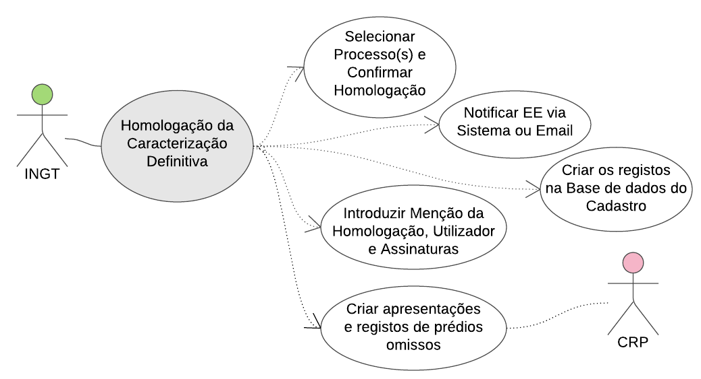

## Emissão de Parecer {#emiss-o-de-parecer}

Um processo constitui toda a sistematização dos dados (proposta da Entidade Executante) até chegar à sua caracterização provisória, a ser exposta em Consulta Pública, incluindo um parecer que qualificará o prédio para Cadastro ou Cadastro Diferido, e sinalização do motivo para cadastro diferido.

Considera-se que existem processos, designados como conforme, isto é que não contêm qualquer aspeto que possa impedir o cadastro definitivo, enquanto outros, por estarem condicionados por disputas, restrições, situações de vulnerabilidade, regularização ou formalização, necessitam de tratamento adicional nessas diferentes dimensões; o sistema não sinaliza automaticamente esta diferenciação pelo que é utilizado uma ferramenta adicional (folha de controlo de processos) de suporte a este modelo.

Figura 50 - Emissão de Parecer

### Emissão de Parecer para Processos Conforme {#emiss-o-de-parecer-para-processos-conforme}

Âmbito

Este procedimento estabelece a análise da proposta que está a ser preparada desde a visita de terreno para ser submetida à Consulta Pública.

Incide nos processos designados como conforme, isto é, que não têm sinalização de:

Conflito;

Situação de vulnerabilidade social ou de género;

Restrições de ambientais ou outras;

Necessidade de formalização do direito.

Por conseguinte, são processos com forte probabilidade de irem para o cadastro definitivo. Nessa perspetiva devem ser qualificados o mais rapidamente possível, resultando numa proposta pronta a seguir para consulta pública.

Se durante a sua qualificação surgir alguma evidência de conflito, situação de vulnerabilidade, restrição, pendência na formalização, etc., é necessário qualificar a proposta noutra secção do manual, conforme for(em) o(s) caso(s).

Finalidade

Obter o parecer da EE com vista a caracterização provisória a ser submetida a Consulta Pública.

Diagrama

Figura 51 - Emissão de Parecer para Processos Conforme

Interveniente

EE (Qualificador).

Sequência típica

1.  O **Qualificador** começa por selecionar no sistema os &lt;&lt;propostas/prédios&gt;&gt; “conforme” e “por qualificar”, agrupados por “parcela” (via mapa ou via lista)

Para cada &lt;&lt;prédio/proposta&gt;&gt; o **qualificador** verifica, analisa e afina:

*   1.  A página de descrição física cadastral do prédio;
    2.  Declarações de titularidade ativas;
    3.  Titulares e direitos;
    4.  Evidências relevantes;
    5.  Anexos.

Finalizar o parecer e escolher a decisão a propor:

Em caso de estar tudo em conformidade com os requisitos para cadastro sinalizar “cadastro” e submeter à fase seguinte (caracterização provisória); Caso contrário:

Em caso de estar tudo em conformidade para o cadastro diferido sinalizar “cadastro diferido”, assinalar o motivo do cadastro diferido (tipologia) no LMITS, e submeter à fase seguinte (caracterização provisória); Caso contrário:

Em função do motivo, e mediante lista de verificação, registar a causa da não qualificação e manter a processo/propostas “pendente”; caso a funcionalidade para gestão de pendentes não exista no sistema, utilizar ferramenta fora do sistema (folha de gestão de processos); nessa folha é indicada a razão da pendência, uma informação fundamental para o seguimento do processo.

Ao confirmar, o sistema submete para a fase seguinte (envio para caracterização provisória – etapa 3 no LMITS) ou mantém o processo pendente, conforme a escolha para cadastro/cadastro diferido/manter pendente.

Pós-Condições

1.  Propostas qualificadas como “cadastro” ou “cadastro diferido”.

Propostas para “cadastro diferido” qualificadas quanto ao motivo para cadastro diferido (tipologia).

Propostas sinalizadas com situações que impendem a qualificação “conforme” e encaminhadas para serem analisadas por qualificadores especializados (ambiente, social e género, conflito, etc.);

Propostas sinalizadas com situação “pendentes”, para efeitos de seguimento;

Prédios estão caracterizados provisoriamente (exceptuando os pendentes).

### Elaboração Recomendações para Casos “não conforme” {#elabora-o-recomenda-es-para-casos-n-o-conforme}

Âmbito

Este procedimento estabelece a análise da proposta que está a ser preparada desde a visita de terreno para ser submetida à consulta pública, e que tenham sido sinalizadas com uma das seguintes situações:

Existência de pelo menos um conflito associado;

Identificação de situação de vulnerabilidade social ou de género;

É uma área urbana de génese ilegal ou é um assentamento irregular;

Restrições ambientais ou outra;

Formalização do direito pendente ou em curso.

Por conseguinte, são processos com menor probabilidade de seguirem para cadastro definitivo.

Nessa perspetiva, devem ser qualificados com ajuda do respetivo especialista das áreas acima indicadas, em concertação com o jurista, resultando numa recomendação incluída na proposta da Entidade Executante.

A proposta/recomendação global entra em linha de conta com a recomendação de cada área em particular.

Caso não estejam disponíveis no sistema as funcionalidades para encaminhamento ou sinalização da necessidade de intervenção de especialistas para emissão de pareceres, este controlo pode ser feito recorrendo a ferramenta fora do sistema (folha de gestão de processos).

Finalidade

Incorporar aspetos particulares de conflitos, social ou género, restrição ambiental ou outra no parecer.

Diagrama

Figura 52 - Emissão de Parecer para Processos Não Conforme

Interveniente

EE (Qualificador Especializado).

Ferramentas

Ferramenta legal: Tipificação e egestão de Conflitos;

Social e Género ASG 5:Parecer e rRecomendações;

Ambiental AMB 3: Pareceres

Sequência típica

1.  O **Qualificador** começa por selecionar no sistema os &lt;&lt;propostas/prédios&gt;&gt; “não conforme” e “por qualificar”, agrupados por “parcela” (via mapa ou via lista); caso o sistema permita apenas saber quais os processos que ainda estão no estado de emissão de parecer (sem saber se estão pendente ou não), recorre-se à ferramenta de fora do sistema preparada para o efeito (folha de gestão de processos).
2.  Para cada &lt;&lt;prédio/proposta&gt;&gt; o qualificador verifica, analisa e afina:

A página de descrição física cadastral do prédio;

*   1.  Declarações de titularidade ativas;
    2.  Titulares e direitos;
    3.  Evidências relevantes e Anexos.

Adicionalmente, o “qualificador especializado” verifica e analisa os casos existentes, na respetiva página de cada proposta, no que respeita:

*   1.  Aos conflitos pendentes;
    2.  Às restrições administrativo-legais, ambientais, urbanísticas ou de outra natureza;
    3.  Aos casos especiais de AUGI/ACI;
    4.  Às situações de vulnerabilidade social ou de género.

Para cada um dos pontos anteriormente indicados, o qualificador deve descrever sucintamente a recomendação relativa a essa dimensão em particular e como é que essa dimensão condiciona a recomendação global para a proposta; a data desta recomendação e o status são atualizados pelo sistema; caso a gestão de fluxo dos diferentes pareceres não esteja a ser feita via sistema, recorrer à ferramenta de fora do sistema anteriormente mencionada (folha de gestão de processos)

Na recomendação da proposta é informada qual a decisão Cadastro Diferido, Cadastro ou Continuar Pendente, em função da dimensão em causa (conflito, género, restrição ambiental, etc.);

Ao confirmar o sistema submete para a fase seguinte (caracterização provisória – etapa 3) ou mantém o processo pendente;

Basta que haja uma recomendação de pendente numa das dimensões de análise para que fique pendente no global;

Recomendação cadastro: todas as situações particulares devem estar com recomendação “Cadastro”

Para cadastro diferido, para as outras situações, assinalando no LMITS o motivo para cadastro diferido (tipologia).

Pós-Condições

1.  Propostas qualificadas como “cadastro” ou “cadastro diferido”;
2.  Propostas para “cadastro diferido” qualificadas quanto ao motivo para cadastro diferido (tipologia);
3.  Propostas sinalizadas com situação “pendentes”, para efeitos de seguimento.
4.  Prédios estão caracterizados provisoriamente (exceptuando os pendentes).

### Emissão de Parecer para Casos Pendentes com vista à sua Caracterização Provisória {#emiss-o-de-parecer-para-casos-pendentes-com-vista-sua-caracteriza-o-provis-ria}

Âmbito

Determinadas &lt;&lt;Propostas&gt;&gt; podem ficar pendentes, pelo facto de não ter sido possível classifica-las num dado momento com exactidão. A título de exemplo, considera-se que uma dada formalização já foi solicitada no cartório ou na Câmara e aguarda a realização do ato; enquanto houver margem temporal a proposta fica como pendente pois se a escritura se realizar em tempo útil pode ser classificado como “Cadastro” em vez de “Cadastro Diferido”.

Assim, como rotina periódica, é necessário consultar estes processos pendentes e verificar e garantir que as ações para a sua resolução estão a ser executadas.

Contudo, à medida que uma determinada seção cadastral está “fechada” (com quase todos os prédios caracterizados provisoriamente), os processos que ainda se encontrarem pendentes deverão avançar, mesmo que isso implique irem para a consulta pública em situação de cadastro diferido.

Com efeito, nenhuma consulta pública pode ter início sem que a respectiva seção cadastral (ou respectivas seções cadastrais), esteja(m) caracterizada(s) na totalidade (ou seja, com todos os seus prédios caracterizados provisoriamente).

Finalidade

Tratar processos pendentes em cadastro diferido visando a sua passagem para o cadastro definitivo.

Tratar processos pendentes visando a sua entrada na caracterização provisória para “cadastro” ou “cadastro diferido”.

Interveniente

*   EE (Backoffice ou Gabinete de Apoio)
*   EAT.

Diagrama

Figura 53 - Emitir Parecer sobre Casos Pendentes

Sequência típica

1.  O Backoffice ou o **Gabinete de Apoio** seleciona todos as propostas com ações pendentes, utilizando os filtros disponíveis; caso a gestão de fluxo dos processo não esteja a ser feita via sistema, recorrer à ferramenta de fora do sistema preparada para o efeito (folha de gestão de processos);

Analisa a proposta e vê qual a ação pendente em curso;

Contacta o titular cadastral pelos meios disponíveis, telefone, correio eletrónico, pessoalmente conforme o caso, e solicita uma atualização do ponto de situação;

No caso de necessitar de esclarecimentos de ordem legal, o operador encaminha o titular para contacto direto com o Qualificador legal;

O Qualificador legal, presta os esclarecimentos e atualiza o registo de ações com a data prevista para a próxima ação, bem como breve anotação do esclarecimento e apoio prestado;

No caso de o processo estar pendente numa das entidades que fazem parte da EAT, o operador contacta o ponto focal da entidade em causa (CM, DGRNI CN, DGRNI CRP, CD), inteirando-se do andamento do processo e solicitando as melhores démarches para a sua conclusão;

Em função do feedback o Backoffice ou o **Gabinete de Apoio** atualiza o registo de ações com a data prevista para a próxima ação;

O processo é encaminhado para emissão de parecer, mesmo que as ações pendentes não tenham sido todas concluídas com sucesso;

O Backoffice ou o **Gabinete de Apoio** fecha o processo e passa para o seguinte.

Pós-Condições

1.  As ações a serem desencadeadas para resolução de processos pendentes foram monitorizadas.

Todos os prédios de seções cadastrais prontas para consulta pública estão caracterizados provisoriamente.

### Comunicação aos titulares de discrepâncias em relação à declaração de titularidade {#comunica-o-aos-titulares-de-discrep-ncias-em-rela-o-declara-o-de-titularidade}

Âmbito

Sempre que a EE verifique que existe(m) discrepância(s) entre a declaração de titularidade e a proposta harmonizada da EE, elaborada com base na análise das evidências em relação à realidade física, à descrição predial e à inscrição matricial, esta informação deve ser comunicada ao(s) titular(es) cadastral(ais), através dum meio idóneo (os tradicionais e ainda e-mail, SMS, etc.). O titular deve ser informado da necessidade de verificar os dados na consulta pública.

Esta comunicação deve ser feita antes do início da respectiva consulta pública (no mínimo com 5 dias de antecedência) mas nada obsta que seja feita antes, logo que o processo em que se verifique a discrepância entre declaração e proposta final da EE se encontre na etapa de caracterização provisória e pronto para consulta.

Finalidade

Comunicar aos titulares discrepâncias entre a declaração e proposta final da EE de caracterização provisória.

Interveniente

EE (Backoffice ou Gabinete de Apoio)

Titulares

Sequência típica

1.  O Backoffice seleciona todos as propostas assinaladas como tendo discrepâncias; caso a gestão de fluxo dos processo não esteja a ser feita via sistema, recorrer à ferramenta de fora do sistema preparada para o efeito (folha de gestão de processos)
2.  O Backoffice ou Gbainete de Apoio envia uma comunicação tipo aos titulares, através dos contactos registados no sistema, mantendo um log dos contactos efectuados.

Pós-Condições

Titulares informados de discrepâncias entre as informações declaradas e os da caracterização provisória.