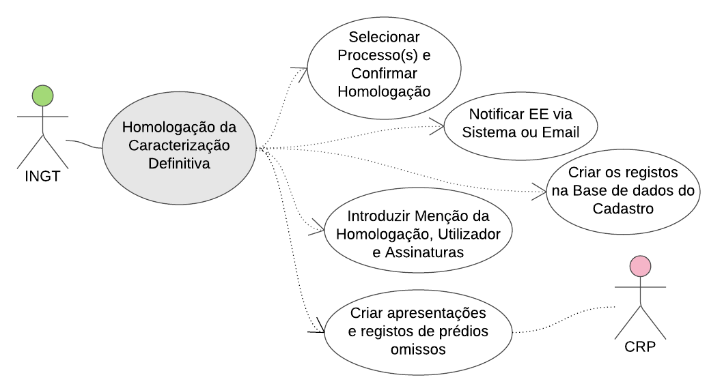

## Preparação da Operação {#prepara-o-da-opera-o}

A preparação da operação do cadastro consiste essencialmente na:

* Definição do Âmbito Territorial, no sistema informático para o efeito;
* Definição das secções cadastrais, como unidade de controlo da operação
* Publicitação da operação do cadastro, com a antecedência prevista na lei;
* A criação de um serviço de apoio ao cidadão para a operação do cadastro;
* Informação e sensibilização sobre a operação que irá decorrer;
* Preparação das evidências para cada parcela por secção cadastral;
* Identificação de áreas urbanas de génese ilegal;
* Identificação de restrições, nomeadamente de caracter ambiental.

Figura 5 - Preparação da Operação de Cadastro

Fluxograma

Figura 6 - Fluxograma preparação da operação do cadastro

### Definição do Âmbito Territorial do Cadastro {#defini-o-do-mbito-territorial-do-cadastro}

#### Âmbito

O primeiro passo a dar na preparação da operação é adequar o Sistema Informático de suporte ao Cadastro, parametrizando com os dados do território para o qual se vai efetuar o cadastro.

Finalidade

Mediante o âmbito territorial definido, carregar todos os mapas e dados de base.

Diagrama

Figura 7 - Definição do âmbito territorial do Cadastro

Sequência Típica

1. Definir qual o território \(Ilha, ou concelho ou freguesia, bairro ou local\);
2. Parametrizar o sistema com informações de base;
3. Identificar entidades públicas relevantes envolvidas no cadastro para esse território;
4. Ativar as evidências para esse território

### Definição de Secções Cadastrais {#defini-o-de-sec-es-cadastrais}

Âmbito

Antes de se iniciar a atividade de campo propriamente dita, existe a necessidade de particionar o território em unidades que possam ser geridas como um todo, da perspetiva da equipa de campo e de _BackOffice_, e do sistema informático, nas várias etapas do processo com especial atenção para a recolha em campo e caracterização provisória e, consequentemente a sua preparação para consulta pública.

Surge assim o conceito de **seção cadastral**, que corresponde sensivelmente a áreas com 800 a 1.000 prédios \(nas áreas urbanas\) e 1.000 ou um pouco mais em áreas rurais \(ou ainda a cerca de 1.000 frações, no caso de grandes empreendimentos ou condomínios\). Estas seções cadastrais são assim no geral unidades mais pequenas que as divisões administrativas de último nível \(bairros nas zonas urbanas / lugares nas zonas rurais\), que devem ser definidos em função de uma estimativa de parcelas a adjudicar a cada missão de terreno. São ainda área que podem ser analisadas em diferentes perspetivas nomeadamente do ordenamento, do ponto de vista social, ambiental e da existência ou não de alguma restrição.

Contudo, caso o sistema informático \(LMITS\) não permita a implementação das seções cadastrais, pode se usar, em substituição, as **divisões administrativas** como seções cadastrais \(essas sim existentes no sistema\), nomeadamente de **bairro** \(em zona urbana\) ou **lugar** \(em zona rural\). Se for o caso, será contudo necessário chegar a uma subdivisão mais operacional das seções cadastrais \(bairros ou lugares\), para efeitos de gestão dos trabalhos e orientação das equipas de terreno. Essa subdivisão a implementar é o **bloco cadastral** e pode ser definida como um quarteirão ou como uma aglomeração de 2 ou 3 quarteirões. De seguida exemplifica-se tal divisão de alguns bairros em Espargos \(zona urbana\), ilha do Sal, em blocos cadastrais.

| Figura 8 - Exemplos de subdivisão de 3 bairros em blocos cadastrais | Legenda |
| --- | --- |

Esta subdivisão em blocos cadastrais vai permitir superar questões operacionais de gestão do trabalho de terreno, mas também de sincronização de dados via internet \(já que quantos mais parcelas, mais dados para sincronizar, mais tempo é necessário, levando a menor eficácia\).

Finalidade

Subdividir a zona a cadastrar em áreas menores, que possam ser afetas a equipas de campo.

Intervenientes

* EE consultando INGT e respetivas CM.

Diagrama

Figura 9 - Definição das Secções Cadastrais

Ferramentas

* Ambiental AMB 1: Caracterização ambiental das seções cadastrais.
* Social e Género ASG 1: Caracterização das seções cadastrais.

Condições de partida

As divisões administrativas estão carregadas no sistema.

Descrição da Sequência típica

1. Selecionar no sistema LMITS o nível informativo das divisões administrativas de menor nível \(bairro nas zonas urbana / lugar nas zonas rurais\);
2. Acionar no sistema a opção criar Secções Cadastrais por bairro / lugar. O Sistema irá mostrar um layer com as secções cadastrais já criadas, caso existam;
3. Com participação dos técnicos de cada área e as respetivas ferramentas de rastreio \(cadastro, ambiente, social e género\) avaliar as secções conseguidas e efetuar os ajustes, criando ou eliminando as secções conforme necessidade;
4. Selecionar as secções consensuais e bloqueá-las utilizando a ferramenta “Bloquear secção”. A partir desse momento a secção pode ser utilizada para atividade de campo;
5. Repetir o processo até que toda a área de cadastro esteja contemplada.

Fluxograma

Figura 10 - Fluxograma Definição das Secções Cadastrais

### Publicitação da Operação de Cadastro {#publicita-o-da-opera-o-de-cadastro}

Âmbito

A publicitação é uma tarefa circunscrita no tempo, cujos requisitos são definidos por lei. Marca o momento a partir do qual o plano operacional de comunicação é implementado, em todas as suas vertentes, pelo que as secções seguintes irão detalhar as sequências típicas a acionar no que tange à comunicação e sensibilização.

O Artigo 13º do Regulamento do Regime Jurídico do Cadastro Predial, com a epígrafe “Publicitação da operação de execução do cadastro”, estabelece que o início dos trabalhos de execução do cadastro é publicitado pelo serviço central responsável pelo cadastro ou outra entidade por ela mandatada, com pelo menos 2 \(dois\) meses de antecedência, por meio de editais a afixar nos locais de estilo, nas sedes dos Municípios e das Freguesias abrangidos e contíguos, e de anúncios a publicar em dois dos jornais mais lidos.

Deve ser garantida a colaboração dos vários serviços públicos existentes na zona geográfica em questão, onde podem também ser afixados editais, bem como a colaboração de instituições relevantes a nível nacional, mediante divulgação da operação nos respetivos sites institucionais. No que toca à diáspora, as Embaixadas e Consulados de Cabo Verde no exterior, instituições e associações ligadas à diáspora, devem participar na publicitação.

Finalidade

Publicitar a Operação de Execução do cadastro e divulgá-la, de acordo com os requisitos legais.

Intervenientes

* INGT;
* EE \(Equipa de comunicação\).

Diagrama

Figura 11 - Publicitação da Operação do Cadastro

Sequência típica / Ações

1. O INGT com o auxílio da EE cria ou adequa o edital de acordo com modelo existente em anexo para o momento exato do início da operação da execução cadastral;

O INGT com o auxílio da EE efetua todas as comunicações e a coordenação interinstitucional necessárias à mobilização dos ministérios, serviços públicos e outras entidades para a tarefa de publicitação;

O INGT com o auxílio da EE publicita com pelo menos 60 dias de antecedência, por meio de editais a afixar nos locais públicos: nas sedes dos Municípios e das Freguesias abrangidos e contíguos, em dois dos jornais mais lidos e na internet por via dos portais oficiais; outros serviços públicos relevantes a nível local; Embaixadas e Consulados e seus parceiros associativos no estrangeiro;

O INGT com o auxílio da EE publicita nesse mesmo prazo o início da operação de cadastro em dois dos jornais mais lidos e uma rádio;

Durante o período de 60 dias o núcleo/equipa de comunicação divulga informações sobre operação da execução do cadastro \(comunicação de massas, incluindo enfoque na diáspora, sites institucionais, anúncios, etc.\);

O INGT, com o apoio do núcleo/equipa de comunicação, organiza uma sessão/evento de lançamento da operação de cadastro, e eventos para dar visibilidade à Operação onde divulga os procedimentos desta;

A EE dá início à campanha pública de informação/sensibilização: implementar as ações de informação nos meios de comunicação social e de massas: TV, rádios \(comerciais, Educativa e comunitárias\), mediante programas curtos recorrentes, entrevistas, debates, entre outros; e jornais \(impressos e versão on-line, outros sites informativos, incluindo a preocupação de fazer chegar a informação à diáspora\), com reportagens, entrevistas, etc. \(ver seções seguintes em relação à comunicação e sensibilização\).

Fluxograma

Figura 12 - Fluxograma Publicitação da Operação do Cadastro

### Criar Gabinete de Apoio {#criar-gabinete-de-apoio}

Âmbito

A partir da publicitação da operação de cadastro, cabe à EE prestar todas as informações e esclarecimentos solicitados por particulares. Por outro lado, a partir da publicitação, pode ter início a entrega das declarações de titularidade \(embora nas iniciativas sistemáticas de registo se promova a recolha das declarações em campo, durante a visita de terreno\). O _gabinete de apoio_ ao cidadão visa dar resposta a estas e outras necessidades de atendimento personalizado, para além do apoio que virá a ser prestado às pessoas durante o trabalho de campo, pelos inquiridores e outros agentes de terreno.

O gabinete é uma peça fundamental da estratégia social e de género da operação de cadastro, na medida em que é particularmente vocacionada para apoiar os grupos vulneráveis na concretização de procedimentos necessários para a formalização de direitos. Assim, o acesso das pessoas em situação de vulnerabilidade ao gabinete e seus serviços deve ser promovido ativamente, mediante a sua ampla divulgação junto dos grupos em questão; por outro lado as pessoas em situação de vulnerabilidade identificadas nas visitas de terreno pelos técnicos devem ser sistematicamente encaminhadas para o gabinete.

Em termos dos apoio/serviços a prestar, o gabinete organiza e assegura todo o atendimento aos titulares, seja através de um balcão de prestação de informações, atendimento durante a consulta pública, o registo de reclamações, o apoio à formalização, o encaminhamento para outras instituições, a assessoria jurídica e o atendimento social e de género. Prevê-se que as necessidades evoluam ao longo das diferentes etapas da operação, passando de um enfoque inicial provável na Declaração de Titularidade, procedimentos para a demarcação, documentação necessária, para um enfoque na assessoria jurídica sobre aspetos conexos ao registo predial, em especial assessoria sobre formalização de direito e apoio na resolução informal de conflitos e encaminhamento para os mecanismos formais de resolução. A etapa da consulta pública da caracterização provisória também implica necessidades de atendimento para verificação dos dados, apoio à elaboração e seguimento de reclamações, e informação sobre os procedimentos que devem ser realizados pelos titulares para formalizar os seus direitos. Por outro lado, o gabinete pode ser um espaço privilegiado para a sinalização/denúncia de práticas fraudulentas no âmbito da operação, prevendo-se adicionalmente que as sugestões, reclamações e denúncias possam também ser veiculadas através do sítio da Casa do Cidadão – Porton di nos ilha \(secção _Ouvidoria do Cidadão_\).

O formato operacional do gabinete pode variar substancialmente de operação de cadastro para operação: idealmente todos os tipos de apoio que o gabinete presta são disponibilizados num mesmo espaço, por técnicos recrutados para o efeito e/ou técnicos destacados por diferentes instituições/organizações \(conforme as parcerias/acordos interinstitucionais que forem estabelecidas\). Os/as técnicos/as que o compõem devem ser formados para o efeito e incluir técnico social, jurista e atendedores. De acordo com o calendário da Operação, o gabinete deve disponibilizar serviços noutras localidades, no sentido de aproximar os serviços dos titulares \(ex. deslocar uma vez por semana assessoria jurídica e/ou social em algumas etapas da operação de cadastro, ou mesmo montar postos de atendimento descentralizados, por exemplo por ocasião das consultas públicas\). O atendimento jurídico e social pode ser prestado no gabinete ou ainda, sempre que necessário no terreno.

Espera-se com o estabelecimento do gabinete contribuir para minimizar potenciais impactos negativos da operação de cadastro; minimizar mal-entendidos, falta de informação, inconsistências ou insuficiência das informações; facilitar a formalização de direitos; contribuir para a resolução de disputas e conflitos; reagir à sinalização/denúncia de práticas fraudulentas.

Com base nas demandas recebidas, o gabinete visa:

Prestar informações e esclarecimentos, presencialmente, via telefone ou internet;

Apoiar cidadãos na compreensão/efetivação dos diversos procedimentos, com enfoque nos grupos mais vulneráveis/com necessidades especiais; incluído apoio no preenchimento da Declaração de Titularidade caso não tenha sido preenchida

Prestar assessoria jurídica, com enfoque nos grupos mais vulneráveis;

Prestar assessoria em matéria de resolução informal de conflitos;

Encaminhar as pessoas/processos para outros serviços, incluindo para a Casa do Direito, para mediação e arbitragem;

Apoiar aos titulares na regularização / formalização de direitos que se revelem informais, incluindo o encaminhamento para isenções e a articulação com entidades relevantes;

Apoiar as pessoas no seguimento dos seus processos junto de outras instituições;

Encaminhar situações de vulnerabilidade para apoio na Casa do Direitos e, quando necessário, para organizações de sociedade civil;

Registar e reagir à sinalização/denúncia de práticas fraudulentas.

Finalidade

Estabelecer um o gabinete de atendimento ao cidadão no âmbito da operação de cadastro, especialmente vocacionada para os grupos mais vulneráveis, em condições de prestar informações e esclarecimentos, aconselhar sobre procedimentos a seguir no âmbito da Operação e para a formalização de direitos, fazer os encaminhamentos necessários, prestar apoio jurídico e de resolução informal de conflitos.

Intervenientes

EE;

Câmara Municipal;

Cartório Notarial e Conservatória;

Casa do Direito;

Casa do Cidadão;

Serviços públicos;

ONG e associações.

Condições de partida

Publicitação oficial da operação \(60 dias antes do seu início\);

Recursos humanos qualificados e capacitados;

Folhetos e outros materiais informativos;

Parcerias estabelecidas com as instituições relevantes \(em particular Câmara Municipal, Cartório, Conservatória, Casa do Direito, etc.\) com vista a um trabalho em rede.

Ações

1. Identificar localização acessível, do ponto de vista físico e social \(ex. escolha de instituição equidistante / neutra em relação aos serviços públicos\);
2. Estabelecer os procedimentos para um trabalho coordenado com as principais instituições \(esta acção será contínua ao longo de toda a Operação, à medida que surgem novas necessidades ao longo das diferentes etapas da Operação\), por exemplo:
   1. A indicação de ponto\(s\) de contacto na EE e em cada uma das principais instituições parceiras;
   2. Harmonização das informações a prestar aos titulares relativamente aos serviços prestados pelas instituições;
3. Identificação das tipologias que podem ser tratadas em bloco \(ex. contratos de aforamento, pedidos de remição de foro, regularização de situações de casa sociais, etc.\)
4. As modalidades de encaminhamento e marcação com a Casa do Direito;
5. Assegurar meios de contactos e horários eficazes \(linha telefónica, email, webpage\);
6. Assegurar recursos humanos formados \(conhecimento do processo de registo e seus objetivos, dos potenciais impactos, tanto positivos como negativos para as pessoas, capacidade de escuta ativa, compreensão da dinâmica social local, incluindo do ponto de vista do género, capacidade de comunicação clara e objetiva\);
7. Divulgar amplamente o gabinete, sua função, serviços disponíveis e formas de contacto;
8. Realizar atendimentos.

### Estabelecer Parceria e Coordenação Local Propícia à Apropriação da Operação de Cadastro {#estabelecer-parceria-e-coordena-o-local-prop-cia-apropria-o-da-opera-o-de-cadastro}

Âmbito

Em termos de envolvimento inicial de todas as forças vivas da sociedade, para além do lançamento oficial da Operação, deve haver \(entre outras actividades\) sessões de apresentação/discussão da Operação \(ex. formato de atelier participativo de meio-dia ou um dia\) com o setor público, privado e da sociedade civil: nomeadamente os/as técnicos/as dos diferentes serviços públicos, empresas, imobiliárias, elites profissionais, juristas, organizações da sociedade civil, incluindo ONG, associações de desenvolvimento comunitário e confissões religiosas. Estas sessões visam a mobilização dos diferentes actores, para que sejam aliados na multiplicação de informações e promoção de um ambiente propício à implementação da Operação. O media são ainda outro parceiro privilegiado a mobilizar.

A boa compreensão dos objetivos da operação de cadastro, e seus impactos previstos, é fundamental para garantir uma adesão generalizada ao registo sistemático, e para evitar que a perspetiva da realização da operação ative ansiedades e tensões, potencialmente desencadeadoras de agudização de conflitos latentes.

A estratégia de comunicação deve prever a existência de uma liderança partilhada da operação, que permitiria uma aliança clara em prol da operação a par de uma mobilização de todas as “forças vivas” em torno dos seus objetivos e resultados esperados.

A estratégia deve seguir um desenho em “cascata”, a começar pela apresentação institucional da operação e da sua “razão de ser”. Nesta etapa o foco é em dois feixes de comunicação: \(i\) interna - dirigida aos intervenientes-chave; e \(ii\) pública - dirigida aos cidadãos com a comunicação da Operação no seu todo, as ações programadas e os benefícios esperados.

Finalidade

Estabelecer uma coordenação e parceria local, incluindo a sociedade civil, com base numa visão partilhada da operação e responsabilidades/participação dos diferentes atores, facilitadora da participação e adesão de todos à iniciativa de registo sistemático.

Intervenientes

EE;

EAT;

Núcleo/equipa de comunicação criado \(incluindo especialista de comunicação e técnicos/agentes comunitários conhecedores da realidade local\);

Serviços públicos;

ONG e associações.

Diagrama

Figura 13 - Estabelecer Parceria e Coordenação Local

Condições de partida

Diagnóstico social, de género e ambiental; análise das partes interessadas; estratégia de comunicação e plano; produtos comunicacionais elaborados \(anúncios, _spots_, cartazes, _folders, indoors,_ etc.\)

Sequência típica

1. O INGT coordena e programa com os seus parceiros a vertente de comunicação de massas do Plano e dá início à campanha, assente numa variedade de meios de comunicação e mensagens para as várias audiências: entidades públicas, privadas, investidores, diáspora, grupos vulneráveis, população em geral;

O núcleo de comunicação atualiza as informações nos _sites_ institucionais identificados para a divulgação da operação \(Gov, MAHOT, INGT, CM, etc.\), em particular as secções de FAQ _\(frequently asked questions\),_ em concertação com o tipo de pedido de informação que chega ao serviço de atendimento; glossário de termos; _links_ com acesso a formulários e documentos, etc.;

Elabora _briefings_ regulares para os meios de comunicação social;

Organiza uma sessão/evento de lançamento da operação de cadastro \(por altura da publicitação da operação\);

Organiza sessões de concertação/formação com técnicos e atores da sociedade civil com enfoque nos que têm por incumbência divulgar a operação, e nos líderes e agentes comunitários, que possuem confiança no seio da comunidade ou do público em geral, com destaque para as organizações que trabalham com as comunidades mais vulneráveis \(identificados na análise das partes interessadas\), para que todos estejam aptos a multiplicar a informação de forma harmonizada aos seus diversos grupos alvo;

Apoia os técnicos, líderes e agentes comunitários na organização de sessões de esclarecimento \(multiplicação\) para os seus respetivos grupos alvo;

Mantém contacto com as instituições e associações ligadas à Diáspora, partilhando todas as informações e materiais e respondendo a solicitações adicionais de informação e/ou encaminhando pedidos;

Organiza eventos e distribui materiais informativos.

### Definição no Sistema das Restrições à Utilização do Território {#defini-o-no-sistema-das-restri-es-utiliza-o-do-territ-rio}

Âmbito

As restrições legais/administrativas e restrições ambientais a ter em conta na Operação do cadastro predial são as que dizem respeito a restrições sobre a titularidade e uso do solo. No caso das restrições ambientais, visam assegurar a compatibilização das funções de proteção, regulação e enquadramento com os usos produtivos e mitigar impactos ao meio ambiente.

As avaliações feitas com o suporte em SIG facilitam o trabalho dos analistas \(equipa ambiental e legal\) na amedida em que permitem uma visão integrada dos planos de informação \(temas/camadas\) selecionados, possibilitam a visualização do cenário atual e a ainda permite caracterizar um cenário prospetivo de implantação e utilização no solo.

Os 5 temas e respectivas camadas \(_layers_ no LMITS\) a ter em conta são os seguintes:

Áreas de servidão, especificando cada um das servidões existentes na área a cadastrar e, para cada uma delas os subníveis de condicionantes \(ex. servidão aeroportuária, zona 7 \(cone de descolagem / aterragem\), zona 2 \(maior risco de acidente, zona 5 \(ruídos\), etc.\);

Áreas de domínio público, especificando cada uma \(ex. orla marítima, etc.\);

Áreas de utilidade pública, tais como as ZDTI;

Áreas de protecção, discriminando as diferentes categorias \(património cultural e áreas protegidas, incluindo as subdivisões reserva natural, parque natural, parque nacional, monumentos naturais, paisagens protegidas, sítios de interesse científico, que são relevantes do ponto de vista do tipo de condicionantes;

Áreas de risco / segurança pública, especificando cada uma delas \(ex. riscos de cheias repentinas / inundação, linhas de água principais e secundárias \(e respectiva zona de buffer\), zonas de inclinação extrema, etc.\).

Outras restrições que não estão listadas acima, não se constituem como camadas \(_layers_\) no LMITS, e são antes registadas a nível da classificação da parcela \(ex. no caso de avançados, equipamentos sociais do domínio público, estradas, prédios encravados, etc.\).

A bases de dados cartográficas geradas pela ferramenta de rastreio SIG serão objeto de análise e discussão entre especialistas da área, incluindo actores locais e ONG com experiência, que visa analisar seus resultados, rediscutir critérios de ponderação e estabelecer critérios. Criado um consenso, o resultado são camadas de temas com as diferentes restrições que associadas ao sistema LMITS facilitarão a tomada de decisão dos operadores de cadastro durante o campo e em gabinete, nas atividades preparatórias e no parecer a enviar a EAT.

Finalidade

Carregar no sistema LMITS as áreas com restrições de caracter administrativo-legal e ambiental.

Condições de partida

Existem layers de informação no SIT \(Sistema de Informação Territorial\);

Existem os mapas carregados no sistema devidamente enquadrados.

Intervenientes

* EE \(Especialista ambiente\).

Sequência Típica

1. O procedimento começa com o carregamento de Temas no sistema que prevejam todas as condicionantes Administrativo-legais e ambientais;
2. Criar os layers necessários, que possam identificar todas as tipologias de restrições administrativo-legais e ambientais e respectivas subdivisões relevantes do ponto de vista cadastral.

Fluxograma

Figura 14 - Fluxograma Definir de Restrições ambientais

Pós-Condições

As restrições administrativo-legais e ambientais durante a fase de preparação estão registados no sistema o que permitirá uma abordagem específica quando se estiver no terreno, mediante ferramentas de caracterização e rastreio ambiental.

### Identificação no sistema de Áreas Urbanas de Génese Ilegal {#identifica-o-no-sistema-de-reas-urbanas-de-g-nese-ilegal}

Âmbito

Uma Área Urbana de Génese Ilegal  \(também conhecida como AUGI\) é uma designação legal atribuída a prédios ou conjunto de prédios contíguos predominantemente ocupados por construções não licenciadas \(construções ilegais\) ou que tenham sido submetidos a uma operação de parcelamento destinado à construção apesar de não ter sido emitida uma licença de loteamento. Configura-se como um layer a introduzir no sistema \(LMITS\) e equipamentos de recolha de dados, por forma a permitir a identificação das parcelas que cabem dentro dos limites da AUGI, já que as parcelas contidas nas AUGI serão alvo de um rastreio específico em campo.

A AUGI pode abranger mais do que um bairro ou zonas de um bairro. Por exemplo na ilha do Sal a AUGI abarca 3 bairros: a totalidade do bairro Alto de São João e algumas zonas/parcelas dos bairros Alto de Santa Cruz e Morro Curral.

Terão o mesmo tratamento as situações/assentamentos que, não sendo AUGI, apresentam características semelhantes. Nomeadamente, situações fora das áreas classificadas como espaços urbanos ou urbanizáveis em que existem construções ilegais e clandestinas, isoladas ou contíguas, decorrente de ocupação espontânea. Sempre que se esteja perante uma situação destas, deve ser accionado o módulo AUGI, viabilizando o rastreio específico conforme definido no _Regime Especial_.

Finalidade

Identificar e delimitar geograficamente o layer AUGI.

Verificar a disponibilidade do módulo AUGI para as situações posteriores em que vai ser utilizado.

Intervenientes

* EE;
* Câmara Municipal;
* INGT.

Diagrama

Figura 15 - Identificação prévia de AUGI

Condições de partida

* Limites das AUGI definidos pelas CM disponíveis no LMITS;
* As imagens ortorectificadas atualizadas estão disponíveis na aplicação LMITS;
* As imagens ortorectificadas estão disponíveis no equipamento;
* O sistema GNSS está operacional via RTK.

Sequência típica do procedimento em AUGI

1. O técnico da EE e o técnico da CM dirigem-se ao primeiro bairro/zona de bairro que faz parte da AUGI;

Começam o procedimento utilizando o Tablet para selecionar na aplicação LMITS a opção &lt;&lt;Editar AUGI&gt;&gt;;

O técnico da EE solicita ao\(s\) técnico\(s\) da CM que mostre\(m\) os vértices e as delimitações da AUGI, conforme previsto no PDM ou Portaria do membro do Governo responsável pelo setor do ordenamento do território e planeamento urbanístico \(com base na delimitação aprovada pela Assembleia Municipal competente\);

Na presença do técnico da CM, o técnico da EE verifica e/ou corrige os vértices do polígono recorrendo ao equipamento GNSS e/ou as imagens ortorectificadas e estabelece a configuração geométrica correta do limite da AUGI;

Repetir o procedimento para todas as AUGI conhecidas no território a Cadastrar.

Sequência típica do procedimento em zona Não AUGI \(com construções clandestinas\)

1. O técnico da EE e o técnico da CM dirigem-se ao primeiro bairro/zona de bairro que faz parte da AUGI;

Começam o procedimento utilizando o Tablet para selecionar na aplicação LMITS a opção &lt;&lt;Editar Não AUGI&gt;&gt;;

O técnico da EE solicita ao\(s\) técnico\(s\) da CM que mostre\(m\) os vértices e as delimitações de áreas com construções clandestinas fora de áreas urbanas ou urbanizáveis;

Na presença do técnico da CM, o técnico da EE verifica e/ou corrige os vértices do polígono recorrendo ao equipamento GNSS e/ou as imagens ortorectificadas e estabelece a configuração geométrica correta dos limites da área com construções clandestinas;

Repetir o procedimento para todas as áreas com construções clandestinas conhecidas no território a Cadastrar.

Pós Condições

Limites de AUGI conhecidos e estão registados no sistema.

Possibilidade de accionar módulo AUGI fora do layer AUGI verificada.

### Preparação de tipologias específicas com a Câmara Municipal: aforamento {#prepara-o-de-tipologias-espec-ficas-com-a-c-mara-municipal-aforamento}

Âmbito

Existem tipologias para as quais deve ser feito um trabalho prévio de preparação com as Câmaras Municipais \(CM\), com vista a agilizar os trabalhos de levantamento, harmonização e emissão de parecer, nomeadamente no caso de **aforamento**. Esta preparação vai contribuir para que menos prédios em aforamento cheguem à caracterização provisória/consulta pública em situação de Cadastro Diferido.

Para os prédios urbanos cedidos pelas CM para construção de habitação, o **contrato de aforamento** é a evidência comprovativa do direito do foreiro. Sem este contrato, o prédio ficará em cadastro diferido. Devem assim ser criadas condições de acesso sistemático da EE a estes contratos; e, nos casos em que não existe, para a sua elaboração sistemática e assinatura pelas partes. A isenção do custo associado à emissão do contrato é um dos incentivos que a Câmara pode considerar e aprovar \(deliberação do órgão competente\).

Os procedimentos são descritos para além da etapa preparatória, para que os intervenientes possam visualizar de forma mais global o esforço a realizar para esta tipologia de aforamento.

Finalidade

Criar condições de acesso da EE aos contratos de aforamento assinados entre a Câmara Municipal e o\(s\) foreiro\(s\).

Identificar as situações de aforamento que carecem de emissão de contrato.

Intervenientes

EE;

Câmara Municipal;

Titulares do direito de aforamento.

Condições de partida

Instrumentos de gestão do Município em relação ao aforamento.

Sequência típica do procedimento

1. O técnico da CM identifica os contratos de aforamento assinados e fornece à EE uma lista dos mesmos \(lista por cidade e bairro\);

Em data previamente acordada, o técnico do backoffice da EE dirige-se à Câmara para digitalizar os contratos. Excepto se existirem cópias digitalizadas dos contratos, caso em que o técnico da Câmara as pode disponibilizar ao técnico da EE por via electrónica;

O técnico da CM verifica as situações de aforamento que carecem de emissão/assinatura de contrato de aforamento \(lista por cidade e bairro\) e informa o técnico da EE dos documentos necessários para o efeito;

As equipas de terreno da EE, ao fazer o levantamento bloco cadastral a bloco cadastral, informam os titulares da necessidade de se firmar o contrato de aforamento e dos documentos necessários para o efeito, e que os devem entregar \(i\) às equipas de terreno da EE ou \(ii\) no gabinete de apoio da EE;

A EE encaminha os documentos para emissão de contrato de aforamento para a Câmara;

A Câmara avisa a EE sempre que estiver pronto um pacote de contratos para assinatura \(por bairro ou sempre que estejam prontos 25 contratos\);

A EE faz saber ao\(s\) titular\(es\) que se devem dirigir à Câmara para assinatura do contrato \(telefonando, mandando sms/e-mail, ou entregando bilhete para o efeito em casa do titular\); se a abordagem for por bairro, EE organiza um encontro em local a definir no bairro e o técnico da Câmara desloca-se para a assinatura _in loco_ do pacote de contratos do bairro.

Pós Condições

EE tem acesso às evidências relativas a situações de aforamento.

A Câmara e a EE estabelecem os procedimentos a seguir para a elaboração/assinatura em massa dos contratos de aforamento em falta

### Preparação de tipologias específicas com a CM: habitação social {#prepara-o-de-tipologias-espec-ficas-com-a-cm-habita-o-social}

Âmbito

Outra situação para a qual deve ser feito um trabalho prévio de preparação é a da **habitação social**. As Câmaras Municipais no geral promovem medidas/programas de habitação social. Alguns destes conferem aos beneficiários algum dos direitos contemplados pela Operação do Cadastro Predial. Neste sentido há que caracterizar os vários tipos de habitação social existentes no\(s\) município\(s\), a natureza do direito atribuído e as condições previstas para a aquisição do mesmo \(ex. doação de terreno para construção, regime de renda resolúvel, etc.\).

Os procedimentos são descritos para além da etapa preparatória, para que os intervenientes possam visualizar de forma mais global o esforço a realizar para as situações de habitação social.

Finalidade

Identificar os tipos de habitação social existentes no Município e respectivas condições contratuais.

Intervenientes

EE;

Câmara Municipal;

Beneficiários/titulares da habitação social.

Condições de partida

Instrumentos de gestão do Município em relação à habitação social.

Sequência típica do procedimento

1. O técnico da CM identifica todas as habitações sociais existentes no Município, por bairro;

O técnico da CM prepara e partilha com a EE uma pasta de contratos \(versão digital ou em papel\), com um exemplar dos diferentes tipos de contratos praticados pela Câmara \(ex. contrato de cada programa ou fase; contrato para situações de isenção; etc.\). A pasta deve conter contratos assinados versus _minutas_;

A equipa jurídica da EE analisa as diferentes tipologias de contratos, quanto à sua natureza legal e dos direitos que confere aos beneficiários/titulares, e emite parecer sobre o tratamento que deve ser dado a cada tipo de contrato do ponto de vista cadastral;

A EE submete este parecer/proposta à Câmara para discussão, com vista à obtenção de uma visão comum, e sempre que necessário sugere aos procedimentos a seguir, para cada tipologia, para a formalização dos direitos; a Câmara deve informar à EE que documentos são necessários para realizar cada procedimento \(ex. elaboração de novo contrato, de escritura, etc.\);

A Câmara actualiza e partilha com a EE uma lista de beneficiários contemplados com habitação social por bairro/programa;

A EE e a Câmara marcam uma sessão de informação conjunta nos bairros em que há habitações sociais, para esclarecimento aos beneficiários/titulares de como se vai processar o levantamento e dos documentos que podem ter de providenciar \(ex. para procedimentos de formalização/regularização\);

Durante o trabalho de campo em bairros com habitação social, as equipa de terreno da EE confirmam que o ocupante das casas se mantem, ou registam alterações, para efeitos de posterior regularização junto da Câmara;

A EE, ao completar um bairro, retorna a lista de beneficiários actualizadas à Câmara, assinalando os casos \(i\) em que precisa de ter acesso ao contrato assinado \(caso o beneficiário/titular não o tenha\) ou \(ii\) os procedimentos de formalização/regularização a acionar \(deve recolher os documentos necessários para o efeito\);

A Câmara avisa a EE sempre que estiver pronto um pacote de contratos/escrituras para assinatura \(por bairro\);

A EE organiza um encontro no bairro em questão e o técnico da Câmara desloca-se para a assinatura _in loco_ do pacote de contratos/escrituras do bairro.

Pós Condições

As tipologias de habitação social existentes no Município são conhecidas.

A Câmara e a EE estabelecem os procedimentos a seguir para a formalização/regularização em massa das habitações sociais.

### Preparação específica para empreendimentos turísticos {#prepara-o-espec-fica-para-empreendimentos-tur-sticos}

Âmbito

Uma situação para a qual deve ser feito um trabalho prévio de preparação é a dos empreendimentos turísticos, especialmente os de maior dimensão.

Para as etapas subsequentes à preparação é descrita uma sequência excepcional para esta tipologia, sempre que aplicável.

Finalidade

Os procedimentos visam identificar previamente:

os limites de cada empreendimento em SIG;

as anexações e desanexações envolvidas com base nas evidências;

a identificação preliminar dos polígonos de cada empreendimento;

a informação de que os empreendimentos foram ou não registados utilizando a solução para o  “regime especial”.

para que a revisão e sistematização da informação na fase de aquisição cadastral seja facilitada.

Intervenientes

EE;

Condições de partida

Acesso às evidências, matriciais, registrais e notariais.

Sequência típica do procedimento

1. A EE constrói uma lista de todos os empreendimentos turísticos existentes na ilha; essa informação pode ser obtida por intermédio dos membros da EAT ou recorrendo diretamente à Autoridade Turística Central \(ATC\).

Para cada empreendimento previamente identificado:

Identificar em SIG os limites dos empreendimentos;

Com base em documentação obtida ou visita preliminar, esboçar em back Office os poligonos envolvidos no empreendimento.

Para cada empreendimento, organizar a informação e contatos dos promotores ou administradores;

Contactar o promotor ou administrador, agendado uma visita para apresentação do projeto e envolvimento esperado na prestação de informações e declarações de titularidade.

Pós Condições

O universo dos empreendimentos é maioritariamente conhecido;

Estão agendadas uma visita preliminar aos empreendimentos.

### Triagem das Parcelas Mediante Evidências {#triagem-das-parcelas-mediante-evid-ncias}

Âmbito

Verificar as evidências associadas aos polígonos, pesquisando e associando as bases de dados atualmente existentes, matriz predial e alvarás da Câmara Municipal, escrituras e registo predial da DGRNI e ainda património do estado no sentido de perceber qual o grau das evidências existentes e se é possível melhorar em determinados casos a situação atual.

Para as evidências já associadas, garantir para cada parcela a perceção temporal dos factos ocorridos e por conseguinte, perceber quem são os titulares ativos já conhecidos.

No final deste processo de triagem pretende-se que a atividade subsequente possa ter acesso ao maior número de evidências possíveis associadas aos prédios \(parcela ou construções nela contidas\).

Finalidade

Verificação e preparação das evidências de cada parcela para os trabalhos subsequentes.

Interveniente

EE \(Analistas Juristas, para-juristas, informáticos\).

Ferramentas

Tipificação de Conflitos.

Diagrama

Figura 16 - Triagem das parcelas mediante evidências

Sequência típica

Para cada parcela, e para cada prédio/fração o analista deve:

1. Começar por identificar quais as evidências presentes: polígonos, Declaração de Titularidade, registo matricial, alvará, escritura pública, ou outro documento que esteja associado \(digitalização de evidência resultante de uma iniciativa da EE ou do declarante\);

Ordenar as evidências pela data dos factos ou do registo, de modo a apurar a cronologia dos factos e apurar a última caracterização predial e respetiva titularidade; se esta funcionalidade não estiver disponível no sistema, a triagem deve ser feita fora do sistema;

Em função da análise efetuada, sinalizar no sistema para tratamento posterior qual a evidência mais relevante a ter em conta em trabalho de campo. Se esta funcionalidade não estiver disponível no sistema, a sinalização deve ser feita fora do sistema \(folha de gestão de processos\);

No caso de evidências que indiciem um potencial conflito, sinalizar a proposta/prédio com a flag “em conflito” e anotar na respetiva página, a tipologia do conflito identificado;

Anotar no respetivo prédio, na página de ações, que medidas devem ser desencadeadas no sentido de se obter evidências adicionais \(por exemplo, existe um registo com base em escritura pública, mas essa escritura não está no sistema, mas existe!\);

Anotar no respetivo prédio, se existe a necessidade de especial atenção no trabalho de campo;

Fluxograma

Figura 17 - Fluxograma triagem de parcelas

Pós- Condições

Triagem e associação de evidências preparadas para o trabalho de terreno por secção cadastral.

### Demarcação das Parcelas {#demarca-o-das-parcelas}

Âmbito

A demarcação das parcelas é um dever do titular cadastral e deve ser efetuada dentro do prazo afixado no Edital onde dá Inicio à Operação Cadastro Predial.

Esta demarcação deve ser feita em conformidade com pelo menos um dos seguintes itens:

Respetivo título

Planta de localização

Em harmonia com a posse dos confinantes.

Esta demarcação é o ato onde o titular cadastral e os seus confinantes colocam “marcas” delimitando os limites das suas parcelas de modo provisório. Os titulares cadastrais devem colocar tantas “marcas” quantas necessárias para à correta definição das suas estremas. Quanto mais irregulares forem os prédios maior será o número de “marcas” a colocar para definir corretamente a sua forma. Sempre que houver uma inflexão numa das estremas deve ser colocada uma “marca”.

As marcas podem ser de várias formas e feitios, o importante é que sejam visíveis para facilitar a identificação das estremas durante a visita da EE.

Nos casos onde as estremas do prédio são: acidentes naturais \(linhas de água, leitos de curso de água, margem de albufeiras, lagoas, linha de costa atlântica, barranco, vale ou outros\); ou acidentes artificiais \(valas, estradas, caminhos, arruamentos, sebes, muros, vedações, escarpados, taludes, construções, edifícios, etc.\). O titular cadastral não deve tentar criar marcas, mas sim identificá-las para quando a equipa da EE estiver na devida parcela/prédio, identificá-las.

Posteriormente, durante a visita de campo, a EE irá fazer a Demarcação final do Prédio, descrito no subcapítulo “Recolher e Dados da Parcela e sua Demarcação”.

A ausência dos confinantes no ato de demarcação não constitui por si só motivo para não se proceder à demarcação, desde que o titular do direito possa indicar com precisão e convicção os limites do prédio. Todas as consequências de erros introduzidos no cadastro como resultado da demarcação incorreta de prédios são da responsabilidade dos respetivos proprietários e usufrutuários, que devem suportar os custos das retificações a que o serviço competente tenha de proceder.

Os titulares que já tenham os prédios demarcados podem mantê-los tal como eles estão, devendo apenas sinalizar os marcos já existentes.

### Declaração dos Titulares {#declara-o-dos-titulares}

Âmbito

A partir da publicitação da operação de cadastro, pode ter início a entrega das declarações de titularidade.

As declarações podem ser feitas e entregues em postos de atendimento publicitados, nomeadamente nos balcões da casa do cidadão, consulados, por via eletrónica utilizando sitio web publicitado no edital mas acima de tudo durante a atividade de recolha em campo. Esta preferência tem a ver com o facto de se pretender reduzir ao mínimo o número de declarações no sistema informático que não estejam associadas ao respetivo prédio, o que só pode ser feito com segurança, na atividade de terreno.

A recolha da Declaração de Titularidade pode ser feita utilizando o sistema disponibilizado via internet e via gabinete de apoio e prestação de serviços ao cidadão criada para a Operação de Cadastro.

#### Declaração feita presencialmente num balcão de atendimento {#declara-o-feita-presencialmente-num-balc-o-de-atendimento}

Finalidade

Preencher uma declaração no sistema, na presença do titular e imprimir cópia da declaração para entregar ao declarante

Interveniente

Declarante/Titular Cadastral;

Atendedor;

EE em coordenação com Casa do Cidadão/Porton Di Nos Ilha/outras entidades.

Diagrama

Figura 18 - Declaração de Titularidade, presencial

Fluxograma

Figura 19 - Fluxograma Declaração de Titularidade, presencial

Figura 20 - Declaração de Titularidade via internet

Condições de partida

1. Existe conectividade ao sistema central;
2. Sistema na função **Declaração de Titularidade** disponível via internet no portal previamente definido;
3. Existe um polígono para a parcela sobre o qual vai haver declaração ou qualquer outra evidência.

Sequência típica

No gabinete de apoio ao cidadão:

1. O **atendedor/inquiridor** começa o procedimento utilizando a aplicação LMITS para selecionar a parcela no mapa, sob indicação e supervisão do \(s\) declarante \(s\);

O atendedor escolhe a opção “ &lt;&lt;propostas/prédios&gt;&gt;”

O sistema apresenta uma lista de prédios \(em caso de PH podem ser muitos\) e o utilizador escolhe qual o prédio;

O utilizador escolha a opção &lt;Nova Declaração&gt;

O sistema apresenta o formulário da declaração com os atributos obrigatórios e facultativos;

O atendedor preenche o formulário conforme indicações do declarante;

O atendedor pede a confirmação dos dados e solicita assinatura no _“pad”_ digitalização de assinaturas

O atendedor imprime uma cópia da declaração e entrega ao Declarante.

Sequência Excecionais

A1 - Não existe nenhum prédio associado a parcela

O atendedor escolhe “caracterização do prédio”,

O sistema apresenta o formulário com tipo de prédio e número de unidades

O sistema cria uma proposta por cada unidade administrativa e uma adicional para o caso de Propriedade Horizontal, todas no estado “preparação”

Continuar com a sequência típica

A2 - A declaração é de propriedade horizontal

Verificar se o declarante cumpre e prova os requisitos previstos na lei \(administrador/condómino\)

Prosseguir com a sequencia típica para o prédio em propriedade horizontal e todas as frações associadas.

#### Declaraões Via Internet: {#declara-es-via-internet}

1. O declarante/titular cadastral acede via internet ao portal de serviços públicos \(portonDiNosIlha\), devidamente autenticado;

Acede à opção Cadastro Predial&gt; Declaração de Titularidade, em destaque durante a operação do cadastro;

O sistema apresenta os passos para o serviço em modo diagrama \(Com mapa, sem mapa, declaração, anexar comprovativos e impressão\);

O sistema apresenta o primeiro passo e pergunta se pretende visualizar e indicar no mapa o lote onde se situa o prédio, recomendando que assim seja;

Se escolher o mapa são apresentados os lotes com ferramentas de navegabilidade e o utilizador tem a opção de clicar no lote, ou de clicar na opção lote não encontrado;

O sistema apresenta o formulário do LIMTS da declaração com os atributos obrigatórios e facultativos;

O **declarante** preenche o formulário conforme indicações no sistema;

O sistema pede a confirmação dos dados e o utilizador valida ou redita;

A declaração é guardada no sistema e caso tenha sido selecionado um lote fica associação estabelecida entre lote e declaração;

O sistema solicita a anexação de documento de identificação \(cópia do bilhete de identidade ou passaporte\);

Terminado, o Sistema imprime uma cópia da declaração, ou cria um PDF ou ainda envia um correio eletrónico com a cópia da declaração para a conta registrada na declaração;

As declarações efetuadas pelo titular ficam disponíveis para posterior acompanhamento.

Fluxograma

Figura 21 - Fluxograma Declaração de titularidade via Internet

Pós- Condições

Registada uma declaração no LIMTS-1.

